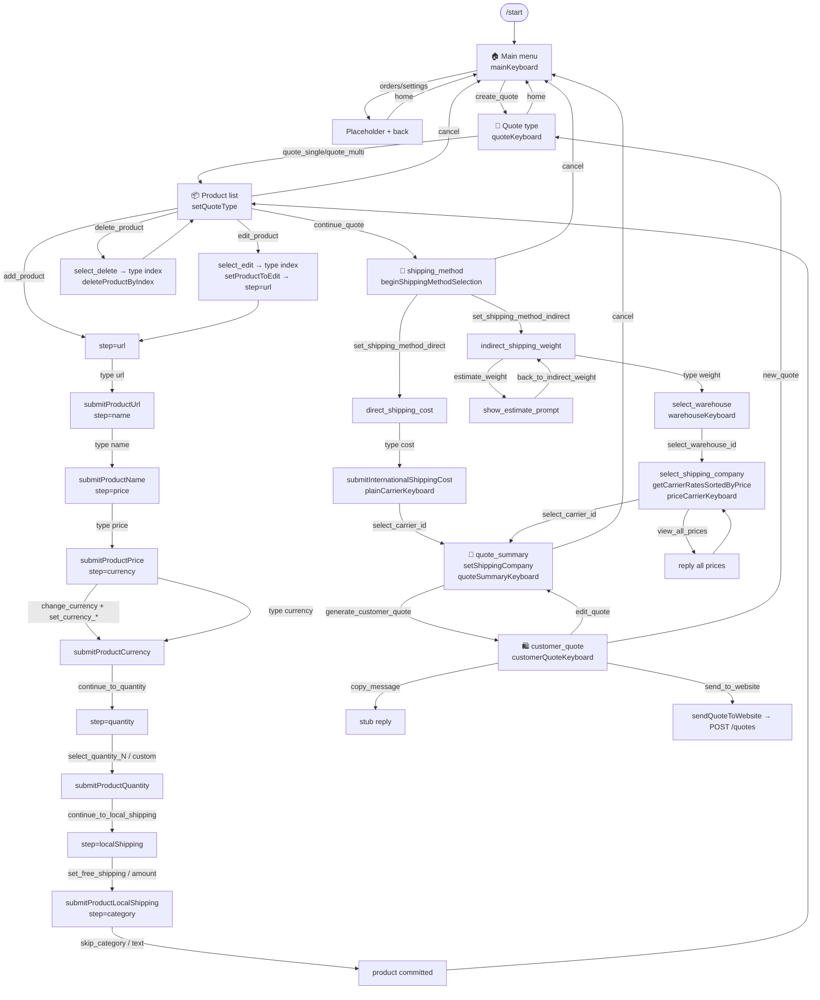

# PROJECT_FLOW_DOCUMENTATION.md

> Reverse‑engineered functional documentation of the Telegram quote bot.
> Scope: **the code as it exists on branch `main`**. Every file was inspected.
> Nothing here is assumed — where behaviour is ambiguous or broken, the exact
> file and line are named instead of guessed.

---

## 0. Orientation for a new senior developer

### 0.1 What this bot is

A grammY (Telegram) bot in TypeScript/ESM. It is a **data‑collection front‑end**:
it walks an operator through building a price quote (products + shipping) and
either renders a customer message or POSTs the quote to a backend. **All real
price math lives on the website**, not here (see `CLAUDE.md`). The bot only
collects and, for indirect shipping, looks up rate tables from Supabase.

### 0.2 Two flows coexist in the tree right now

There are **two entry points** in [src/app.ts](src/app.ts):

| Command | Handler | Status |
|---|---|---|
| `/start` | `startHandler` | **The live product.** The full legacy wizard described in this document. |
| `/dashboard` | `dashboardHandler` | **New, partial (commit 1).** Renders a read‑only dashboard. Its buttons are inert — their `callback_data` is not yet handled anywhere. |

This document reverse‑engineers the **live wizard** (`/start`), because that is
the flow a user can actually complete today. The dashboard renderer is
documented separately in §12 as "present but not wired".

### 0.3 The runtime spine

```
app.ts                     registers 3 update listeners on the Bot
 ├─ bot.command("start")   → start.handler.ts
 ├─ bot.command("dashboard")→ dashboard.handler.ts        (new, isolated)
 ├─ bot.on("callback_query:data") → callback.handler.ts   (every button)
 └─ bot.on("message:text")        → message.handler.ts    (every typed line)
```

- **Buttons** are all `callback_query:data` updates. One central handler
  ([callback.handler.ts](src/handlers/callback.handler.ts)) answers the callback
  query, then tries `handleQuoteCallback` first and falls back to
  `handleCommonCallback`.
- **Typed text** is routed **entirely by `session.draft.currentStep`**
  ([message.handler.ts](src/handlers/message.handler.ts)). There is no scene/FSM
  library; `currentStep` *is* the state machine.

### 0.4 Session

grammY in‑memory `session()` ([bot.ts](src/telegram/bot.ts)). Shape defined by
`SessionData` ([session.ts](src/session/session.ts)); the whole working set lives
under `session.draft` (`Draft` in [types/quote.ts](src/types/quote.ts)).
**No persistence adapter** → every process restart wipes all drafts.

### 0.5 Dead / inert files (named, not skipped)

- [src/telegram/router.ts](src/telegram/router.ts) — **empty file**. Imported by nothing.
- [src/lib/shipping.repository.ts](src/lib/shipping.repository.ts) — `@deprecated`
  compatibility wrapper. **Zero callers** (verified by grep). Re‑exports the provider.
- [src/services/quote.mapper.ts](src/services/quote.mapper.ts) — used only by the
  (currently non‑functional) "send to website" path.
- New commit‑1 files (`dashboard/dashboard.ts`, `constants/callbacks.ts`,
  `utils/html.ts`, `handlers/dashboard.handler.ts`) — reachable only via `/dashboard`.

---

## 1. File inventory (every participating file)

### Entry / runtime
| File | Responsibility |
|---|---|
| [src/app.ts](src/app.ts) | Registers listeners, starts polling, global error log |
| [src/telegram/bot.ts](src/telegram/bot.ts) | Constructs `Bot`, installs `session()` middleware |
| [src/config/env.ts](src/config/env.ts) | Loads `.env` → `env` object |
| [src/telegram/router.ts](src/telegram/router.ts) | **EMPTY — unused** |

### Handlers
| File | Responsibility |
|---|---|
| [src/handlers/start.handler.ts](src/handlers/start.handler.ts) | `/start` → main menu |
| [src/handlers/dashboard.handler.ts](src/handlers/dashboard.handler.ts) | `/dashboard` → new dashboard (isolated) |
| [src/handlers/callback.handler.ts](src/handlers/callback.handler.ts) | Central button dispatcher |
| [src/handlers/callbacks/quote.callbacks.ts](src/handlers/callbacks/quote.callbacks.ts) | All quote/product/shipping button logic |
| [src/handlers/callbacks/common.callbacks.ts](src/handlers/callbacks/common.callbacks.ts) | CANCEL, HOME, ORDERS, SETTINGS |
| [src/handlers/message.handler.ts](src/handlers/message.handler.ts) | Text router keyed on `currentStep` |

### Keyboards
| File | Responsibility |
|---|---|
| [src/keyboards/index.ts](src/keyboards/index.ts) | Barrel re‑export of all keyboards |
| [src/keyboards/main.keyboard.ts](src/keyboards/main.keyboard.ts) | Main menu |
| [src/keyboards/quote.keyboard.ts](src/keyboards/quote.keyboard.ts) | Quote‑type chooser |
| [src/keyboards/product.keyboard.ts](src/keyboards/product.keyboard.ts) | 11 product‑entry keyboards |
| [src/keyboards/shipping.keyboard.ts](src/keyboards/shipping.keyboard.ts) | 9 shipping keyboards |
| [src/keyboards/back.keyboard.ts](src/keyboards/back.keyboard.ts) | Single "⬅️ رجوع"→`home` button |

### Services / logic
| File | Responsibility |
|---|---|
| [src/services/quote.service.ts](src/services/quote.service.ts) | All session mutations (product + shipping lifecycle) |
| [src/services/shipping-pricing.service.ts](src/services/shipping-pricing.service.ts) | Thin façade over the shipping provider |
| [src/services/quote.api.service.ts](src/services/quote.api.service.ts) | "Send to website" orchestration |
| [src/services/quote.mapper.ts](src/services/quote.mapper.ts) | `Draft` → API payload |

### Shipping engine (the "keep untouched" core)
| File | Responsibility |
|---|---|
| [src/shipping/telegram-shipping.provider.ts](src/shipping/telegram-shipping.provider.ts) | Public façade: warehouses, carriers, priced rates |
| [src/shipping/shipping.gateway.ts](src/shipping/shipping.gateway.ts) | **Only** Supabase reader for shipping data |
| [src/shipping/shipping.calculator.ts](src/shipping/shipping.calculator.ts) | Pure weight‑tier lookup + USD→SAR (3.75) |
| [src/shipping/shipping.types.ts](src/shipping/shipping.types.ts) | Warehouse/Carrier/CarrierRate/ShippingQuote types |
| [src/lib/shipping.repository.ts](src/lib/shipping.repository.ts) | **Deprecated** wrapper, unused |
| [src/lib/supabase.ts](src/lib/supabase.ts) | Supabase client (service‑role key) |

### Formatters / API / utils / types / constants / session
| File | Responsibility |
|---|---|
| [src/formatters/quote.formatters.ts](src/formatters/quote.formatters.ts) | All wizard message text |
| [src/api/quote.client.ts](src/api/quote.client.ts) | `axios.post(API_BASE_URL/quotes)` |
| [src/utils/url.ts](src/utils/url.ts) | URL validation + hostname normalisation |
| [src/types/quote.ts](src/types/quote.ts) | `Product`, `Draft`, `QuoteStep`, `Currency`, `QuoteType` |
| [src/types/quote-api.ts](src/types/quote-api.ts) | API payload types |
| [src/types/shipping.ts](src/types/shipping.ts) | Re‑exports shipping types |
| [src/constants/callback.actions.ts](src/constants/callback.actions.ts) | **40** legacy callback constants |
| [src/constants/callbacks.ts](src/constants/callbacks.ts) | New namespaced callbacks (dashboard only) |
| [src/session/session.ts](src/session/session.ts) | `SessionData` + `initialSession()` |

### New / dashboard (commit 1, isolated)
| File | Responsibility |
|---|---|
| [src/dashboard/dashboard.ts](src/dashboard/dashboard.ts) | Pure `renderDashboard(session)` |
| [src/utils/html.ts](src/utils/html.ts) | HTML escaping for the dashboard |

---

## 2. The state machine key: `currentStep`

`session.draft.currentStep: QuoteStep | undefined`. Text messages are dispatched
purely on this value ([message.handler.ts:73‑76](src/handlers/message.handler.ts#L73)).
If `currentStep` is `undefined`, **typed text is ignored**.

`QuoteStep` union ([types/quote.ts:12‑29](src/types/quote.ts#L12)):

```
url · name · price · currency · quantity · localShipping · category
select_edit · select_delete
shipping_method · direct_shipping_cost · indirect_shipping_weight
show_estimate_prompt · select_warehouse · select_shipping_company
quote_summary · customer_quote
```

Text‑handled steps: `url, name, price, currency, quantity, localShipping,
category, direct_shipping_cost, indirect_shipping_weight, select_edit,
select_delete`. The remaining steps (`shipping_method, show_estimate_prompt,
select_warehouse, select_shipping_company, quote_summary, customer_quote`) either
ignore text or reply with a "use the buttons" nudge.

---

## 3. STEP‑BY‑STEP FLOW

> Message text lives in [quote.formatters.ts](src/formatters/quote.formatters.ts)
> and inline strings in [quote.callbacks.ts](src/handlers/callbacks/quote.callbacks.ts).
> All wizard messages use `parse_mode: "Markdown"`.

---

### Step 1 — Bot start

**Current screen:** none (fresh chat).
**Trigger:** `/start`.
**Displayed message:**
```
🏠 *القائمة الرئيسية*

اختر أحد الخيارات:
```
**Buttons** — `mainKeyboard` ([main.keyboard.ts](src/keyboards/main.keyboard.ts)):

| Text | callback_data | File | Created in |
|---|---|---|---|
| 🧾 إنشاء تسعيرة | `create_quote` | main.keyboard.ts | module const |
| 📦 إدارة الطلبات | `orders` | main.keyboard.ts | module const |
| ⚙️ الإعدادات | `settings` | main.keyboard.ts | module const |

**User input:** none.
**Session changes:** none (session is lazily created by middleware; `initialSession()` shape).
**Executed functions:** `startHandler(ctx)` → `ctx.reply(...)`.
**Files involved:** app.ts, start.handler.ts, keyboards/index.ts, main.keyboard.ts.
**Next step:** `create_quote` → Step 2. `orders`/`settings` → Step 1b.
**Conditions:** none.

> Note: `startHandler` uses `ctx.reply` (new message), while every later screen
> uses `ctx.editMessageText` (edits the same message). So the very first tap
> converts the main menu into the quote screen in place.

---

### Step 1b — Orders / Settings placeholders

**Trigger:** `orders` or `settings`.
**Handler:** `handleCommonCallback` ([common.callbacks.ts](src/handlers/callbacks/common.callbacks.ts)).
**Displayed message:** `📦 إدارة الطلبات` or `⚙️ الإعدادات`.
**Buttons:** `backKeyboard` — single `⬅️ رجوع` → `home`.
**Session changes:** none.
**Next step:** `home` → returns to main menu (Step 1 message, `mainKeyboard`).
**Conditions:** none. These are stubs — no further logic.

---

### Step 2 — Choose quote type

**Trigger:** `create_quote`.
**Handler:** `handleQuoteCallback` case `CREATE_QUOTE` ([quote.callbacks.ts:134](src/handlers/callbacks/quote.callbacks.ts#L134)).
**Displayed message:**
```
🧾 *إنشاء تسعيرة*

اختر نوع الطلب:
```
**Buttons** — `quoteKeyboard` ([quote.keyboard.ts](src/keyboards/quote.keyboard.ts)):

| Text | callback_data |
|---|---|
| 🛍️ طلب من موقع واحد | `quote_single` |
| 🛒 طلب من عدة مواقع | `quote_multi` |
| ⬅️ رجوع | `home` |

**Session changes:** none yet.
**Executed functions:** `ctx.editMessageText(...)`.
**Next step:** `quote_single`/`quote_multi` → Step 3. `home` → Step 1.
**Conditions:** none.

---

### Step 3 — Product list (empty)

**Trigger:** `quote_single` (`QUOTE_SINGLE`) or `quote_multi` (`QUOTE_MULTI`).
**Handler:** [quote.callbacks.ts:141‑155](src/handlers/callbacks/quote.callbacks.ts#L141).
**Executed functions:** `setQuoteType(session, "single"|"multi")` → `ctx.editMessageText`.

**`setQuoteType`** ([quote.service.ts:28‑42](src/services/quote.service.ts#L28)) — **destructive reset**:
```
session.quoteType            = "single" | "multi"
session.draft.products       = []          // ⚠ wipes any existing products
session.draft.activeProductId= undefined
session.draft.currentStep    = undefined
session.draft.lastPromptMessageId = undefined
+ all shipping fields → undefined
```

**Displayed message** (`getProductListText`, empty case):
```
📦 المنتجات

لا توجد منتجات حتى الآن.
```
**Buttons** — `productListKeyboard(hasProducts=false)` ([product.keyboard.ts:4](src/keyboards/product.keyboard.ts#L4)):

| Text | callback_data |
|---|---|
| ➕ إضافة منتج | `add_product` |
| ✏️ تعديل منتج | `edit_product` |
| 🗑 حذف منتج | `delete_product` |
| ⬅️ رجوع | `back_to_quote_type` |
| ❌ إلغاء | `cancel` |

(When `hasProducts=true`, a `➡️ متابعة` → `continue_quote` row is prepended.)

**Next step:** `add_product` → Step 4.
**Conditions:**
```
IF products.length > 0 → show "متابعة" (continue_quote) → Step 12
ELSE                    → no continue button
```

---

### Step 4 — Begin product entry (ask URL)

**Trigger:** `add_product`.
**Handler:** [quote.callbacks.ts:157‑163](src/handlers/callbacks/quote.callbacks.ts#L157).
**Executed functions:** `beginProductEntry(session)` → `ctx.editMessageText`.

**`beginProductEntry`** ([quote.service.ts:44‑47](src/services/quote.service.ts#L44)):
```
session.draft.activeProductId = randomUUID()
session.draft.currentStep     = "url"
```

**Displayed message** (`getProductPromptText`, step `url`):
```
🔗 *أرسل رابط المنتج*

يرجى إرسال رابط المنتج الآن:
```
**Buttons** — `productUrlKeyboard`:

| Text | callback_data |
|---|---|
| ⬅️ رجوع | `product_list` |
| ❌ إلغاء | `cancel` |

**User input:** now expected — text handled by `currentStep = "url"`.
**Next step:** user types URL → Step 5.

---

### Step 5 — Submit URL (creates the Product)

**Trigger:** typed text, `currentStep = "url"`.
**Handler:** `messageHandler` case `"url"` ([message.handler.ts:77‑85](src/handlers/message.handler.ts#L77)).
**Executed functions:** `submitProductUrl(session, rawText)` → `updatePrompt(...)`.

**Validation** — `validateUrl` ([utils/url.ts](src/utils/url.ts)):
- trims; empty → error `الرابط فارغ...`
- prepends `https://` if no `scheme://`
- `new URL()` parse; failure → `الرابط غير صالح...`
- protocol must be http/https → else error
- hostname lower‑cased, `www.` stripped → `website`

**On success** — `submitProductUrl` ([quote.service.ts:62‑102](src/services/quote.service.ts#L62)) builds a **fresh Product**:
```
Product = {
  id: activeProductId ?? randomUUID(),
  url, website,
  name: undefined, price: undefined,
  currency: "USD", quantity: 1, localShipping: 0,
  category: undefined,
}
```
Single‑site carry‑over: if `quoteType==="single"` and a previous product exists,
`currency/quantity/localShipping` are copied from the last product.
Then: replace product with same id if present, else push.
```
session.draft.currentStep = "name"
```
> ⚠ **Rebuild bug:** because this always constructs a fresh Product and
> overwrites by id, using it as the edit entry point (Step 20a) **erases
> name/price/category**.

**On failure:** `ctx.reply(errorMessage)` — a **new** message, never cleaned up.

**`updatePrompt`** ([message.handler.ts:42‑67](src/handlers/message.handler.ts#L42)):
tries `editMessageText` on `draft.lastPromptMessageId`; on any failure sends a
new message and stores its id.
> ⚠ **Split‑surface bug:** no callback ever sets `lastPromptMessageId`. It is
> assigned *only* on the fallback `ctx.reply` path (line 66). So the first typed
> step after a button screen edits nothing found → sends a new message → the
> chat now has two competing surfaces.

**Displayed message** (step `name`): `📌 *ما هو اسم المنتج؟* ...`
**Buttons:** `productInputKeyboard` (⬅️ `product_list`, ❌ `cancel`).
**Next step:** Step 6.

---

### Step 6 — Submit name

**Trigger:** text, `currentStep = "name"`.
**Handler:** [message.handler.ts:87‑95](src/handlers/message.handler.ts#L87).
**Function:** `submitProductName` ([quote.service.ts:104‑117](src/services/quote.service.ts#L104)).
**Validation:** non‑empty (trimmed) else `اسم المنتج لا يمكن أن يكون فارغاً.`
**Session:** `activeProduct.name = trimmed`; `currentStep = "price"`.
**Message:** `💲 *ما هو سعر المنتج؟*`; keyboard `productInputKeyboard`.
**Next step:** Step 7.

---

### Step 7 — Submit price

**Trigger:** text, `currentStep = "price"`.
**Handler:** [message.handler.ts:97‑105](src/handlers/message.handler.ts#L97).
**Function:** `submitProductPrice` ([quote.service.ts:119‑136](src/services/quote.service.ts#L119)).
**Validation:** `Number(raw)` finite and `> 0`, else `السعر غير صالح...`.
**Session:** `activeProduct.price = parsed`; `currentStep = "currency"`.
**Message:** `💱 *العملة الحالية:* <cur>` (step `currency`).
**Buttons:** `currencyMainKeyboard`:

| Text | callback_data |
|---|---|
| 🔄 تغيير العملة | `change_currency` |
| ➡️ متابعه | `back_to_product_list` |
| ❌ إلغاء | `cancel` |

> ⚠ **Abandonment trap:** here "➡️ متابعه" is wired to `back_to_product_list`
> ([product.keyboard.ts:67](src/keyboards/product.keyboard.ts#L67)), so pressing
> Continue jumps straight back to the product list with **no quantity / local
> shipping / category** captured. Only after changing currency does the
> *confirmed* keyboard route Continue to the quantity step.

**Next step:** Step 8.

---

### Step 8 — Currency

Two ways to set currency:

**8a — Type it:** text, `currentStep="currency"` → `submitProductCurrency`
([quote.service.ts:138‑164](src/services/quote.service.ts#L138)). Validates against
`USD, SAR, EUR, GBP, AUD, CAD, SGD`. On success → `currencyConfirmedKeyboard`.

**8b — Buttons:** `change_currency` → shows `currencyKeyboard` (7 currency buttons,
each `set_currency_*`). Pressing one → `submitProductCurrency` →
`currencyConfirmedKeyboard`.

**`currencyKeyboard`** buttons: `set_currency_usd/sar/eur/gbp/aud/cad/sgd`,
`product_list`, `cancel`.
**`currencyConfirmedKeyboard`:**

| Text | callback_data |
|---|---|
| 🔄 تغيير العملة | `change_currency` |
| ➡️ متابعة | `continue_to_quantity` |
| ⬅️ رجوع | `back_to_product_list` |
| ❌ إلغاء | `cancel` |

**Next step:** `continue_to_quantity` → Step 9.

---

### Step 9 — Quantity

**Trigger:** `continue_to_quantity` → `currentStep="quantity"` → `quantityMainKeyboard`.
**`quantityMainKeyboard`:** `➕ إدخال رقم`→`show_quantity_selector`, `back_to_product_list`, `cancel`.

Paths:
- `show_quantity_selector` → `quantityKeyboard` (buttons `1..5` = `select_quantity_1..5`, `➕ إدخال رقم`=`enter_custom_quantity`, back, cancel).
- `select_quantity_N` → `submitProductQuantity(session, "N")` → `quantityConfirmedKeyboard`.
- `enter_custom_quantity` → `productInputKeyboard`; then text `currentStep="quantity"` → `submitProductQuantity`.

**`submitProductQuantity`** ([quote.service.ts:166‑182](src/services/quote.service.ts#L166)):
integer `> 0` else error. `activeProduct.quantity = quantity`.

**`quantityConfirmedKeyboard`:** `➕ إدخال رقم`=`show_quantity_selector`,
`➡️ متابعة`=`continue_to_local_shipping`, back, cancel.
**Next step:** `continue_to_local_shipping` → Step 10.

---

### Step 10 — Local shipping

**Trigger:** `continue_to_local_shipping` → `currentStep="localShipping"` → `shippingKeyboard`.
**`shippingKeyboard`:** `مجاني`=`set_free_shipping`, `product_list`, `cancel`.

Paths:
- `set_free_shipping` → `submitProductLocalShipping(session,"مجاني")`.
- text → `submitProductLocalShipping(session, raw)`.

**`submitProductLocalShipping`** ([quote.service.ts:184‑208](src/services/quote.service.ts#L184)):
empty or `"مجاني"` → `localShipping = 0`; else `Number(raw)` finite `>= 0` else error.
On success → `currentStep = "category"`.
**Message:** `🏷️ *التصنيف (اختياري)*`; keyboard `categoryKeyboard`.
**Next step:** Step 11.

---

### Step 11 — Category → product committed

**`categoryKeyboard`:** `تخطي`=`skip_category`, `product_list`, `cancel`.

Paths:
- `skip_category` → `skipProductCategory` (category=undefined).
- text → `submitProductCategory(session, raw)` (category = trimmed or undefined).

Both ([quote.service.ts:210‑232](src/services/quote.service.ts#L210)) then:
```
session.draft.currentStep     = undefined
session.draft.activeProductId = undefined
```
**Message:** product list (`getProductListText`, now populated) + `productListKeyboard(true)`.
**Next step:** Step 3 (list) with a `متابعة` button → Step 12.
**Conditions:**
```
IF quoteType == "multi" → user may press add_product again (Step 4) to add more
```

---

### Step 12 — Continue to shipping

**Trigger:** `continue_quote`.
**Handler:** [quote.callbacks.ts:287‑299](src/handlers/callbacks/quote.callbacks.ts#L287).
**Guard:** if `products.length === 0` → `ctx.reply("أضف منتجًا واحدًا على الأقل...")`, stay.
**Function:** `beginShippingMethodSelection` ([quote.service.ts:234‑244](src/services/quote.service.ts#L234)) — resets all shipping fields, `currentStep="shipping_method"`.
**Message:** `🚚 *اختر طريقة الشحن*`.
**Buttons** — `shippingMethodKeyboard`:

| Text | callback_data |
|---|---|
| 🚚 الشحن المباشر | `set_shipping_method_direct` |
| 📦 الشحن غير المباشر | `set_shipping_method_indirect` |
| ⬅️ رجوع | `back_to_product_list` |
| ❌ إلغاء | `cancel` |

**Next step / condition:**
```
IF set_shipping_method_direct   → Step 13  (DIRECT branch)
IF set_shipping_method_indirect → Step 14  (INDIRECT branch)
```

---

### Step 13 — DIRECT: enter international cost → carriers

**13a — choose direct:** `set_shipping_method_direct` → `setShippingMethodDirect`
([quote.service.ts:246‑252](src/services/quote.service.ts#L246)): `shippingMethod="direct"`,
`currentStep="direct_shipping_cost"`. Message `🚚 *الشحن المباشر*`; keyboard
`shippingInputKeyboard` (⬅️ `back_to_shipping_method`, ❌ `cancel`).

**13b — type cost:** text, `currentStep="direct_shipping_cost"` →
`submitInternationalShippingCost` ([quote.service.ts:262‑274](src/services/quote.service.ts#L262)).
Validation: finite `> 0`. Sets `internationalShippingCost`, `currentStep="select_shipping_company"`.
Then the handler calls `listCarriers()` and shows `plainCarrierKeyboard(carriers)`.

**`plainCarrierKeyboard`** ([shipping.keyboard.ts:71](src/keyboards/shipping.keyboard.ts#L71)):
one button per carrier `select_carrier_<id>`, then `back_to_shipping_details`, `cancel`.
**Next step:** Step 16 (carrier selection, **no warehouse, no price**).

---

### Step 14 — INDIRECT: weight → warehouse

**14a — choose indirect:** `set_shipping_method_indirect` → `setShippingMethodIndirect`
([quote.service.ts:254‑260](src/services/quote.service.ts#L254)): `shippingMethod="indirect"`,
`currentStep="indirect_shipping_weight"`. Message `📦 *الشحن غير المباشر*`; keyboard
`indirectShippingKeyboard`:

| Text | callback_data |
|---|---|
| 🤖 تقدير الوزن | `estimate_weight` |
| ⬅️ رجوع | `back_to_shipping_method` |
| ❌ إلغاء | `cancel` |

**14b — estimate (optional):** `estimate_weight` → `setShowEstimatePrompt`
(`currentStep="show_estimate_prompt"`) → renders a long AI prompt listing product
names+urls ([quote.formatters.ts:79‑113](src/formatters/quote.formatters.ts#L79)); keyboard
`estimateWeightKeyboard` (⬅️ `back_to_indirect_weight`, ❌ `cancel`). Typed text at
this step just re‑replies the prompt.

**14c — type weight:** text, `currentStep="indirect_shipping_weight"` →
`submitIndirectShippingWeight` ([quote.service.ts:276‑288](src/services/quote.service.ts#L276)).
Validation finite `> 0`. Sets `indirectWeight`, `currentStep="select_warehouse"`.
Then handler calls `listWarehouses()` and shows `warehouseKeyboard(warehouses)`.
**Next step:** Step 15.

---

### Step 15 — Select warehouse (INDIRECT only)

**`warehouseKeyboard`** ([shipping.keyboard.ts:31](src/keyboards/shipping.keyboard.ts#L31)):
one button per warehouse `select_warehouse_<id>` (duplicate names get `(#id)`
suffix), then `back_to_indirect_weight`, `cancel`.

**Trigger:** `select_warehouse_<id>` (prefix match at top of `handleQuoteCallback`,
[quote.callbacks.ts:66‑94](src/handlers/callbacks/quote.callbacks.ts#L66)).
**Logic:**
1. parse id; require `indirectWeight != null`, else `ctx.reply` internal error.
2. `listWarehouses()`, find by id; if missing → `المستودع غير موجود.`
3. `selectWarehouse(session, id, name)` → sets `warehouseId/warehouseName`,
   `currentStep="select_shipping_company"`.
4. `getCarrierRatesSortedByPrice(warehouseId, weight)` → priced rates.
5. Edit message to shipping prompt + `priceCarrierKeyboard(rates)`.

**`priceCarrierKeyboard`** ([shipping.keyboard.ts:54](src/keyboards/shipping.keyboard.ts#L54)):
one button per rate `"<carrier> - <price> <currency>"` = `select_carrier_<id>`, then
`📊 عرض جميع الأسعار`=`view_all_prices`, `back_to_warehouse`, `cancel`.
**Next step:** Step 16.

---

### Step 16 — Select carrier

**Trigger:** `select_carrier_<id>` (prefix match, [quote.callbacks.ts:96‑131](src/handlers/callbacks/quote.callbacks.ts#L96)).
**Branch:**
```
IF shippingMethod == "indirect" AND warehouseId != null AND indirectWeight != null:
    rate = getSelectedCarrierRate(warehouseId, carrierId, weight)
    if !rate → ctx.reply("لا يوجد سعر متاح...")
    setShippingCompany(name, rate.price, rate.currency)   // price + currency stored
ELSE (direct):
    carrier = listCarriers().find(id)
    setShippingCompany(carrier.name)                      // no price
```
**`setShippingCompany`** ([quote.service.ts:306‑317](src/services/quote.service.ts#L306)):
sets `shippingCompany`, `shippingPrice?`, `shippingCurrency?`, `currentStep="quote_summary"`.
**Message:** `getQuoteSummaryText` (see §7). **Buttons:** `quoteSummaryKeyboard`:

| Text | callback_data |
|---|---|
| 📝 إنشاء رسالة العميل | `generate_customer_quote` |
| ⬅️ رجوع | `back_to_shipping_company` |
| ❌ إلغاء | `cancel` |

**Next step:** Step 17.

---

### Step 16b — View all prices (INDIRECT only side action)

**Trigger:** `view_all_prices` ([quote.callbacks.ts:468‑482](src/handlers/callbacks/quote.callbacks.ts#L468)).
**Guard:** requires indirect + warehouse + weight, else `ctx.reply` explaining.
**Action:** `getCarrierRatesSortedByPrice` → `ctx.reply(formatAllPricesText(rates))`.
> ⚠ Sends a **new** message duplicating the priced list already on the buttons.
**Next step:** stays on Step 15/16.

---

### Step 17 — Customer quote

**Trigger:** `generate_customer_quote` → `beginCustomerQuote` (`currentStep="customer_quote"`).
**Message:** `getCustomerQuoteText` ([quote.formatters.ts:127‑162](src/formatters/quote.formatters.ts#L127)) — see §7.2.
**Buttons** — `customerQuoteKeyboard`:

| Text | callback_data |
|---|---|
| 📋 نسخ الرسالة | `copy_message` |
| 📦 إرسال إلى الموقع | `send_to_website` |
| ✏️ تعديل التسعيرة | `edit_quote` |
| 🧾 تسعيرة جديدة | `new_quote` |

**Next step / conditions:**
```
copy_message    → Step 18a
send_to_website → Step 18b
edit_quote      → Step 18c (back to summary, Step 16 message)
new_quote       → Step 18d (reset → quote‑type screen)
```

---

### Step 18 — Terminal actions

**18a — `copy_message`** ([quote.callbacks.ts:429‑432](src/handlers/callbacks/quote.callbacks.ts#L429)):
`ctx.reply("📋 سيتم تفعيل خاصية النسخ لاحقًا.")`. **Stub — no copy implemented.**

**18b — `send_to_website`** ([quote.callbacks.ts:434‑443](src/handlers/callbacks/quote.callbacks.ts#L434)):
`sendQuoteToWebsite(session)` → guard (≥1 product) → `buildQuotePayload` →
`submitQuote` → `axios.post(${API_BASE_URL}/quotes, payload)`.
On failure → `❌ فشل الإرسال: <msg>`; on success → `✅ تم إرسال التسعيرة...`.
> ⚠ Depends on `API_BASE_URL` being set and an endpoint existing. If `API_BASE_URL`
> is empty, `quote.client.ts` returns a "لم يتم تكوين رابط الخادم" failure. The
> existence of `/quotes` is unverified in this repo.

**18c — `edit_quote`** → `setQuoteSummaryStep` (`currentStep="quote_summary"`) → summary message + `quoteSummaryKeyboard`.

**18d — `new_quote`** → `resetQuoteSession` (full wipe, see §9) → message
`🏠 *القائمة الرئيسية* ...` but with `quoteKeyboard` (quote‑type chooser).

---

### Step 19 — Cancel (any step)

**Trigger:** `cancel` → `handleCommonCallback` case `CANCEL`
([common.callbacks.ts:13‑19](src/handlers/callbacks/common.callbacks.ts#L13)):
`resetQuoteSession(session)` → main menu message + `mainKeyboard`.

---

### Step 20 — Edit / delete product (from list)

**20a — Edit:** `edit_product` → `currentStep="select_edit"`; message = product list +
"أرسل رقم المنتج الذي تريد تعديله:". User types index (1‑based). Handler
([message.handler.ts:203‑218](src/handlers/message.handler.ts#L203)) validates range,
calls `setProductToEdit(session, index-1)` ([quote.service.ts:333‑342](src/services/quote.service.ts#L333)):
```
activeProductId = product.id
currentStep     = "url"           // ⚠ re‑enters Step 5 → submitProductUrl REBUILDS the product
```
> ⚠ **Data loss:** editing re‑enters the URL step; typing anything runs
> `submitProductUrl`, which reconstructs the Product with `name/price/category =
> undefined`. There is no field‑level edit.

**20b — Delete:** `delete_product` → `currentStep="select_delete"`. User types index →
`deleteProductByIndex(session, index-1)` ([quote.service.ts:344‑353](src/services/quote.service.ts#L344)):
`products.splice(index,1)`, clears step/activeProductId. Message = product list.

---

### Back‑navigation callbacks (unwind the screen stack)

| callback_data | Sets currentStep | Rebuilds screen |
|---|---|---|
| `back_to_quote_type` | undefined | quote‑type chooser |
| `back_to_product_list` | undefined | product list |
| `product_list` | (unchanged) | product list |
| `back_to_shipping_method` | shipping_method | method chooser |
| `back_to_indirect_weight` | indirect_shipping_weight | indirect prompt |
| `back_to_shipping_details` | direct_shipping_cost / indirect_shipping_weight | per method |
| `back_to_warehouse` | select_warehouse | warehouse list (re‑fetch) |
| `back_to_shipping_company` | select_shipping_company | carrier list (re‑fetch, priced if indirect) |

All in [quote.callbacks.ts](src/handlers/callbacks/quote.callbacks.ts) switch cases.

---

## 4. CALLBACK MAP

Source of truth: [callback.actions.ts](src/constants/callback.actions.ts) (40 constants).
Dispatch order: `callback.handler.ts` → `handleQuoteCallback` (prefix checks, then
switch) → if it returns `false`, `handleCommonCallback`.

| callback_data | File / function | Effect → next state |
|---|---|---|
| `create_quote` | quote.callbacks `CREATE_QUOTE` | → quote‑type screen |
| `quote_single` | quote.callbacks `QUOTE_SINGLE` → `setQuoteType("single")` | → product list |
| `quote_multi` | quote.callbacks `QUOTE_MULTI` → `setQuoteType("multi")` | → product list |
| `add_product` | quote.callbacks `ADD_PRODUCT` → `beginProductEntry` | step=`url` |
| `product_list` | quote.callbacks `PRODUCT_LIST` | → product list |
| `edit_product` | quote.callbacks `EDIT_PRODUCT` | step=`select_edit` |
| `delete_product` | quote.callbacks `DELETE_PRODUCT` | step=`select_delete` |
| `continue_quote` | quote.callbacks `CONTINUE_QUOTE` → `beginShippingMethodSelection` | step=`shipping_method` |
| `change_currency` | quote.callbacks `CHANGE_CURRENCY` | shows `currencyKeyboard` |
| `continue_to_quantity` | quote.callbacks | step=`quantity` |
| `show_quantity_selector` | quote.callbacks | shows `quantityKeyboard` |
| `continue_to_local_shipping` | quote.callbacks | step=`localShipping` |
| `set_currency_usd/sar/eur/gbp/aud/cad/sgd` | quote.callbacks → `submitProductCurrency` | currency set |
| `select_quantity_1..5` | quote.callbacks → `submitProductQuantity` | quantity set |
| `enter_custom_quantity` | quote.callbacks | shows `productInputKeyboard` |
| `set_free_shipping` | quote.callbacks → `submitProductLocalShipping("مجاني")` | step=`category` |
| `skip_category` | quote.callbacks → `skipProductCategory` | product committed |
| `back_to_quote_type` | quote.callbacks | → quote‑type screen |
| `back_to_product_list` | quote.callbacks | → product list |
| `set_shipping_method_direct` | quote.callbacks → `setShippingMethodDirect` | step=`direct_shipping_cost` |
| `set_shipping_method_indirect` | quote.callbacks → `setShippingMethodIndirect` | step=`indirect_shipping_weight` |
| `estimate_weight` | quote.callbacks → `setShowEstimatePrompt` | step=`show_estimate_prompt` |
| `select_warehouse_<id>` | quote.callbacks (prefix) → `selectWarehouse` | step=`select_shipping_company` |
| `select_carrier_<id>` | quote.callbacks (prefix) → `setShippingCompany` | step=`quote_summary` |
| `view_all_prices` | quote.callbacks | replies price list |
| `back_to_shipping_method` | quote.callbacks | step=`shipping_method` |
| `back_to_indirect_weight` | quote.callbacks | step=`indirect_shipping_weight` |
| `back_to_shipping_details` | quote.callbacks | step=direct/indirect |
| `back_to_warehouse` | quote.callbacks | step=`select_warehouse` |
| `back_to_shipping_company` | quote.callbacks | step=`select_shipping_company` |
| `generate_customer_quote` | quote.callbacks → `beginCustomerQuote` | step=`customer_quote` |
| `copy_message` | quote.callbacks | **stub reply** |
| `send_to_website` | quote.callbacks → `sendQuoteToWebsite` | POST /quotes |
| `edit_quote` | quote.callbacks → `setQuoteSummaryStep` | step=`quote_summary` |
| `new_quote` | quote.callbacks → `resetQuoteSession` | → quote‑type screen |
| `cancel` | common.callbacks `CANCEL` → `resetQuoteSession` | → main menu |
| `home` | common.callbacks `HOME` | → main menu |
| `orders` | common.callbacks `ORDERS` | placeholder |
| `settings` | common.callbacks `SETTINGS` | placeholder |

**Dashboard callbacks** (defined in [callbacks.ts](src/constants/callbacks.ts), **not handled anywhere yet**):
`p:add`, `p:edit:<id>`, `p:del:<id>`, `p:manage`, `sh:m:direct`, `sh:m:indirect`,
`sh:wh`, `sh:w`, `q:cancel`, `nav:home`.

---

## 5. KEYBOARD MAP

### main.keyboard.ts — `mainKeyboard`
`create_quote`, `orders`, `settings`. Used: Step 1, after cancel/home.

### quote.keyboard.ts — `quoteKeyboard`
`quote_single`, `quote_multi`, `home`. Used: Step 2, after `new_quote`.

### back.keyboard.ts — `backKeyboard`
`home`. Used: orders/settings placeholders.

### product.keyboard.ts (11 keyboards)
| Keyboard | Buttons (callback_data) | Used |
|---|---|---|
| `productListKeyboard(hasProducts)` | [`continue_quote` if hasProducts], `add_product`, `edit_product`, `delete_product`, `back_to_quote_type`, `cancel` | product list |
| `productUrlKeyboard` | `product_list`, `cancel` | step url |
| `productInputKeyboard` | `product_list`, `cancel` | steps name/price/custom‑qty |
| `currencyKeyboard` | `set_currency_*`(7), `product_list`, `cancel` | change currency |
| `currencyMainKeyboard` | `change_currency`, `back_to_product_list`, `cancel` | after price typed |
| `currencyConfirmedKeyboard` | `change_currency`, `continue_to_quantity`, `back_to_product_list`, `cancel` | after currency set |
| `quantityKeyboard` | `select_quantity_1..5`, `enter_custom_quantity`, `back_to_product_list`, `cancel` | quantity picker |
| `quantityMainKeyboard` | `show_quantity_selector`, `back_to_product_list`, `cancel` | quantity entry |
| `quantityConfirmedKeyboard` | `show_quantity_selector`, `continue_to_local_shipping`, `back_to_product_list`, `cancel` | after qty set |
| `shippingKeyboard` | `set_free_shipping`, `product_list`, `cancel` | local shipping |
| `categoryKeyboard` | `skip_category`, `product_list`, `cancel` | category |

### shipping.keyboard.ts (9 keyboards)
| Keyboard | Buttons | Used |
|---|---|---|
| `shippingMethodKeyboard` | `set_shipping_method_direct`, `set_shipping_method_indirect`, `back_to_product_list`, `cancel` | Step 12 |
| `shippingInputKeyboard` | `back_to_shipping_method`, `cancel` | direct cost |
| `indirectShippingKeyboard` | `estimate_weight`, `back_to_shipping_method`, `cancel` | indirect weight |
| `estimateWeightKeyboard` | `back_to_indirect_weight`, `cancel` | AI estimate |
| `warehouseKeyboard(warehouses)` | `select_warehouse_<id>`×N, `back_to_indirect_weight`, `cancel` | Step 15 |
| `priceCarrierKeyboard(rates)` | `select_carrier_<id>`×N, `view_all_prices`, `back_to_warehouse`, `cancel` | indirect carriers |
| `plainCarrierKeyboard(carriers)` | `select_carrier_<id>`×N, `back_to_shipping_details`, `cancel` | direct carriers |
| `quoteSummaryKeyboard` | `generate_customer_quote`, `back_to_shipping_company`, `cancel` | Step 16 |
| `customerQuoteKeyboard` | `copy_message`, `send_to_website`, `edit_quote`, `new_quote` | Step 17 |

---

## 6. SESSION MAP

`SessionData` ([session.ts](src/session/session.ts)):
```
quoteType : "single" | "multi" | undefined
draft     : Draft
```
`Draft` ([types/quote.ts:43‑56](src/types/quote.ts#L43)):

| Property | Created (initial) | Written | Read | Cleared |
|---|---|---|---|---|
| `products[]` | `initialSession` `[]` | `submitProductUrl` (push/replace), `deleteProductByIndex` | formatters, mapper, guards | `setQuoteType`, `resetQuoteSession` |
| `activeProductId` | undefined | `beginProductEntry`, `setProductToEdit` | `getActiveProduct` in service | after category commit, delete, reset |
| `currentStep` | undefined | almost every service fn + several callbacks | `messageHandler`, formatters | commit/reset/back |
| `lastPromptMessageId` | undefined | **only** `updatePrompt` fallback (message.handler) | `updatePrompt` | reset |
| `shippingMethod` | undefined | `setShippingMethodDirect/Indirect` | branches, formatters, mapper | `beginShippingMethodSelection`, reset |
| `internationalShippingCost` | undefined | `submitInternationalShippingCost` | mapper, formatter | reset |
| `indirectWeight` | undefined | `submitIndirectShippingWeight` | warehouse/carrier lookups, mapper | reset |
| `warehouseId` | undefined | `selectWarehouse` | carrier lookups | reset |
| `warehouseName` | undefined | `selectWarehouse` | formatters, mapper | reset |
| `shippingCompany` | undefined | `setShippingCompany` | formatters, mapper | reset |
| `shippingPrice` | undefined | `setShippingCompany` (indirect only) | formatters, mapper | reset |
| `shippingCurrency` | undefined | `setShippingCompany` (indirect only) | formatters, mapper | reset |

**Product** ([types/quote.ts:31‑41](src/types/quote.ts#L31)):
`id, url, website, name?, price?, currency?, quantity?, localShipping?, category?`.

**Per‑product field writers:** `submitProductUrl` (url/website + defaults),
`submitProductName`, `submitProductPrice`, `submitProductCurrency`,
`submitProductQuantity`, `submitProductLocalShipping`,
`submitProductCategory`/`skipProductCategory`.

---

## 7. Message text catalogue (formatters)

### 7.1 `getProductListText` / `getProductPromptText`
Product list header `📦 المنتجات`, then per product `<n>. <website>\n<name>\n<price currency>`.
Prompts per step: url/name/price/currency/quantity/localShipping/category.

### 7.2 `getCustomerQuoteText` (Step 17)
Header `🛍️ *ملخص الطلب للعميل*`; per product name/website/price/currency/quantity;
shipping detail (direct cost or indirect weight); method; optional warehouse; carrier;
optional shipping price; then three literal placeholders:
```
العمولة: سيتم احتسابها من قبل الموقع
الضرائب التقديرية: سيتم احتسابها من قبل الموقع
الإجمالي النهائي: سيتم احتسابه من قبل الموقع
```
> The bot never computes commission/tax/total; the website is the source of truth.

### 7.3 `getQuoteSummaryText` (Step 16)
`🧾 *ملخص التسعيرة*` with quote type, method, warehouse, carrier, shipping price,
product count, product lines, shipping detail.

### 7.4 `formatAllPricesText` (Step 16b)
`📊 *جميع الأسعار...*` numbered `<n>. <carrier> - <price> <currency>`.

---

## 8. FUNCTION CALL GRAPH

```
app.ts
├── bot.command("start")            → start.handler.startHandler → ctx.reply(mainKeyboard)
├── bot.command("dashboard")        → dashboard.handler.dashboardHandler → renderDashboard (isolated)
├── bot.on("callback_query:data")   → callback.handler.callbackHandler
│      ├── ctx.answerCallbackQuery()
│      ├── quote.callbacks.handleQuoteCallback(ctx, action)
│      │      ├── prefix: select_warehouse_ → listWarehouses → selectWarehouse → getCarrierRatesSortedByPrice → editMessageText(priceCarrierKeyboard)
│      │      ├── prefix: select_carrier_   → getSelectedCarrierRate / listCarriers → setShippingCompany → editMessageText(quoteSummaryKeyboard)
│      │      └── switch(action) → { setQuoteType | beginProductEntry | submit* | begin* | set* | back_* | generate_customer_quote | send_to_website | ... }
│      └── (if false) common.callbacks.handleCommonCallback(ctx, action) → { CANCEL | HOME | ORDERS | SETTINGS }
└── bot.on("message:text")          → message.handler.messageHandler
       └── switch(session.draft.currentStep) → submit* → updatePrompt(editMessageText | reply)

shipping-pricing.service  →  telegram-shipping.provider  →  shipping.gateway (Supabase)
                                                          →  shipping.calculator (pure math)
quote.api.service → quote.mapper.buildQuotePayload → quote.client.submitQuote → axios.post
```

---

## 9. Reset semantics

- **`setQuoteType`** ([quote.service.ts:28](src/services/quote.service.ts#L28)) — wipes
  products + all shipping fields (destructive; re‑picking type loses everything).
- **`beginShippingMethodSelection`** — clears shipping fields only.
- **`resetQuoteSession`** ([quote.service.ts:355‑371](src/services/quote.service.ts#L355)) —
  full reset (`quoteType=undefined`, new empty `draft`). Called by `cancel` and `new_quote`.
- **`setSessionForNewQuote`** — alias to `resetQuoteSession` (defined, not referenced by handlers).

---

## 10. QUOTE CREATION FLOW (main menu → customer message)

```
Main menu (/start)
  → create_quote            → quote‑type screen
  → quote_single|quote_multi → setQuoteType → product list (empty)
  → add_product             → beginProductEntry (step=url)
     type url  → submitProductUrl   (Product created; step=name)
     type name → submitProductName  (step=price)
     type price→ submitProductPrice (step=currency)
     currency  → submitProductCurrency (buttons or text)
     continue_to_quantity  → quantity (buttons or custom)
     continue_to_local_shipping → localShipping (free or amount)
     category  → submitProductCategory/skip → product COMMITTED
  → [multi: repeat add_product]
  → continue_quote          → beginShippingMethodSelection (step=shipping_method)
  → [SHIPPING FLOW §11]     → setShippingCompany (step=quote_summary)
  → generate_customer_quote → customer_quote screen
  → copy_message (stub) | send_to_website (POST) | edit_quote | new_quote
```

---

## 11. SHIPPING FLOW (detailed)

```
shipping_method
├── DIRECT
│     set_shipping_method_direct → step=direct_shipping_cost
│     type cost → submitInternationalShippingCost → step=select_shipping_company
│     listCarriers() → plainCarrierKeyboard        (NO price, NO warehouse)
│     select_carrier_<id> → setShippingCompany(name)          → quote_summary
│
└── INDIRECT
      set_shipping_method_indirect → step=indirect_shipping_weight
      [estimate_weight → show_estimate_prompt → AI prompt text]
      type weight → submitIndirectShippingWeight → step=select_warehouse
      listWarehouses() → warehouseKeyboard
      select_warehouse_<id> → selectWarehouse → step=select_shipping_company
          getCarrierRatesSortedByPrice(warehouseId, weight) → priceCarrierKeyboard
          [view_all_prices → formatAllPricesText reply]
      select_carrier_<id> → getSelectedCarrierRate → setShippingCompany(name, price, currency) → quote_summary
```

**Pricing engine** (untouched core):
- `getRatesForWeight` groups Supabase `shipping_rates` by carrier, runs
  `ShippingCalculator.getRate(table, weight)` per carrier.
- `ShippingCalculator` ([shipping.calculator.ts](src/shipping/shipping.calculator.ts)):
  `lb = ceil(weight)`, `nearestAvailableWeight` = smallest tier `>= lb` else highest
  tier (`capped`), `convertToSar = price * 3.75` if USD.
- Provider returns `price` **already in SAR**, `currency: "SAR"`, sorted ascending.
- **Discount, additional fees, commission, tax: NOT present in the bot.** Those exist
  only on the website. The bot's customer message defers all of them with literal
  "سيتم احتسابها من قبل الموقع" placeholders.

**Gateway** ([shipping.gateway.ts](src/shipping/shipping.gateway.ts)) — Supabase tables:
`warehouses(id,country_id,name)`, `carriers(id,name)`,
`shipping_rates(warehouse_id,carrier_id,weight,price,currency,delivery_days)`.

---

## 12. PRODUCT FLOW (fields, validation, storage)

| Field | Step | Function | Validation | Storage |
|---|---|---|---|---|
| url/website | url | `submitProductUrl` + `validateUrl` | non‑empty, parseable, http(s), has host | new Product (defaults currency USD, qty 1, localShipping 0) |
| name | name | `submitProductName` | non‑empty trimmed | `product.name` |
| price | price | `submitProductPrice` | finite > 0 | `product.price` |
| currency | currency | `submitProductCurrency` | in {USD,SAR,EUR,GBP,AUD,CAD,SGD} | `product.currency` |
| quantity | quantity | `submitProductQuantity` | integer > 0 | `product.quantity` |
| localShipping | localShipping | `submitProductLocalShipping` | "مجاني"/empty→0, else finite ≥ 0 | `product.localShipping` |
| category | category | `submitProductCategory`/`skip` | optional (trim or undefined) | `product.category` |

**Single‑site carry‑over:** for `quoteType==="single"`, a new product inherits
currency/quantity/localShipping from the previous one ([quote.service.ts:83‑88](src/services/quote.service.ts#L83)).

**Error handling pattern:** every `submit*` returns `ServiceResult`
(`{success:true}` | `{success:false,errorMessage}`); handlers `ctx.reply(errorMessage)`
on failure (new, uncleaned messages) and keep the same step.

---

## 13. Known defects / landmines (named, with locations)

1. **Split surface** — `lastPromptMessageId` never set by callbacks; only on
   `updatePrompt` fallback ([message.handler.ts:66](src/handlers/message.handler.ts#L66)).
   First typed step after a button spawns a second message.
2. **Edit = rebuild** — `setProductToEdit`→step `url`→`submitProductUrl` reconstructs
   the Product, erasing name/price/category ([quote.service.ts:71‑98](src/services/quote.service.ts#L71)).
3. **Currency "continue" abandons product** — `currencyMainKeyboard`'s "متابعه" →
   `back_to_product_list` ([product.keyboard.ts:67](src/keyboards/product.keyboard.ts#L67)).
4. **`setQuoteType` wipes products** — backing to type screen and re‑picking loses draft.
5. **`copy_message` is a stub** ([quote.callbacks.ts:430](src/handlers/callbacks/quote.callbacks.ts#L430)).
6. **`send_to_website` unverified** — needs `API_BASE_URL` + a real `/quotes` endpoint.
7. **In‑memory session** — restart wipes drafts ([bot.ts:8‑12](src/telegram/bot.ts#L8)).
8. **Markdown fragility** — product names with `_ * [` can break `parse_mode:"Markdown"`.
9. **Dead files** — `router.ts` (empty), `shipping.repository.ts` (unused).
10. **Two `bot.catch`** — one in bot.ts, one in app.ts (both log).

---

## 14. COMPLETE MERMAID FLOWCHART



---

## 15. How to reproduce the whole flow from zero

1. `.env`: `BOT_TOKEN`, `OWNER_ID`, `SUPABASE_URL`, `SUPABASE_SERVICE_ROLE_KEY`
   (+ `API_BASE_URL` for send). See [config/env.ts](src/config/env.ts).
2. `npm run dev` (`tsx src/app.ts`).
3. `/start` → إنشاء تسعيرة → choose type → add product(s) → continue → choose
   direct/indirect → (weight+warehouse for indirect) → carrier → summary →
   customer message.
4. Supabase must contain `warehouses`, `carriers`, `shipping_rates` for indirect
   pricing to return anything.

---

*End of document. Every source file in `src/` was inspected; empty/dead files
(`router.ts`, `shipping.repository.ts`) and the isolated new dashboard are noted
explicitly rather than omitted.*
