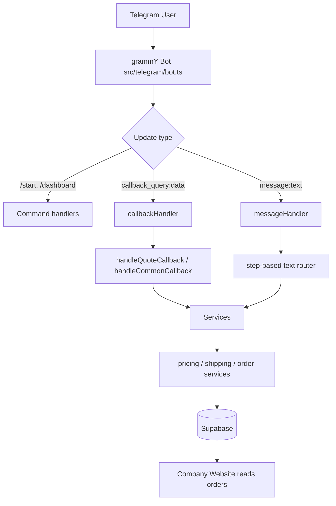
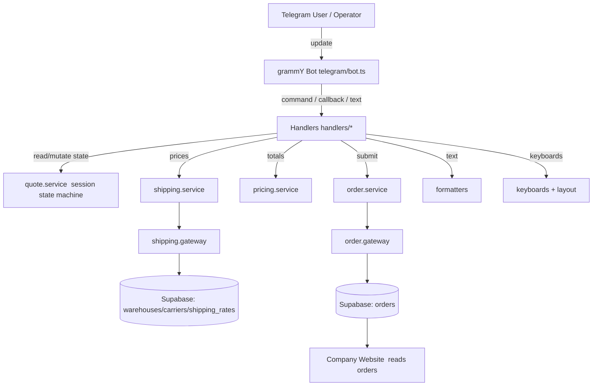
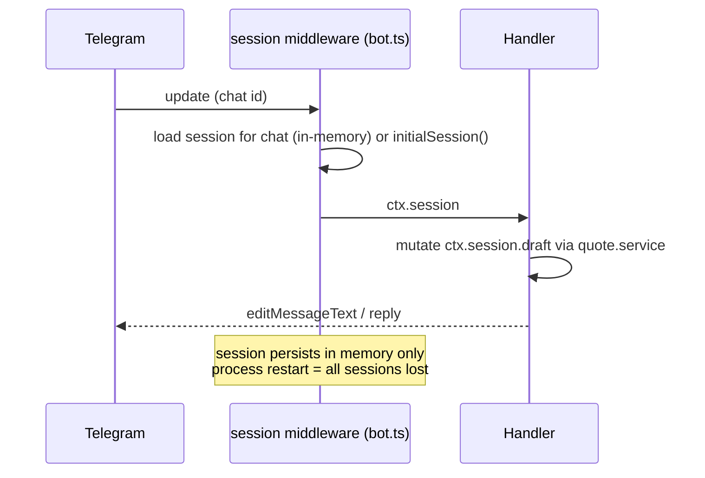
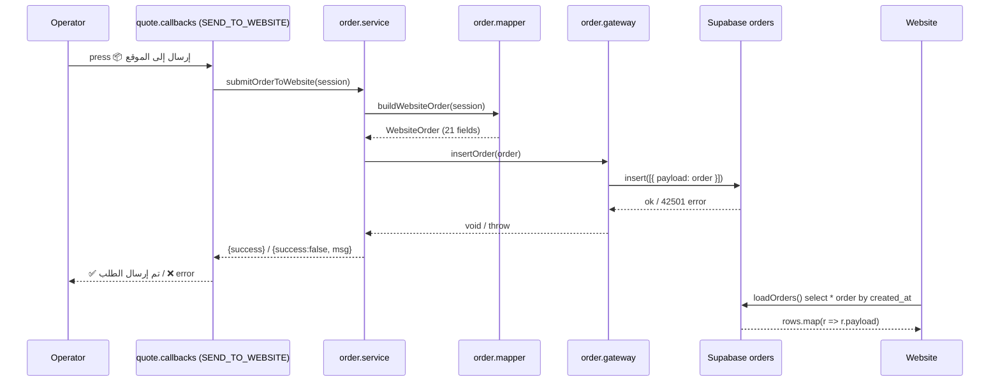
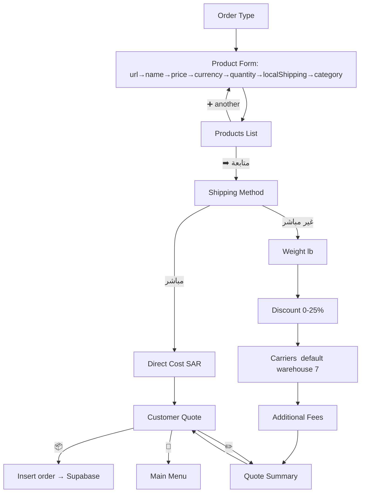
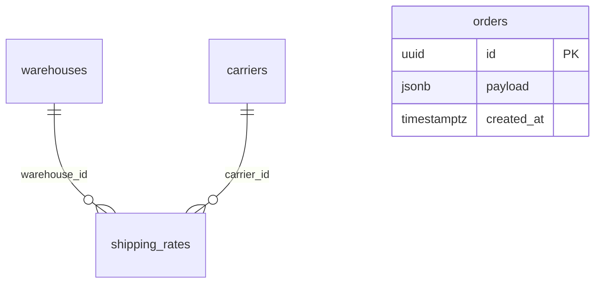
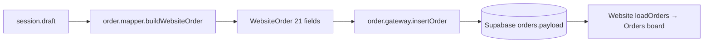

# PROJECT HANDBOOK — AnwarMoafa Telegram Quoting Bot

> **Single source of truth for this repository.**
> This handbook is written so that a brand‑new developer, with **zero** prior context and no access to past conversations, can understand, run, debug, and extend the entire system.
>
> Everything here is derived from the actual source code in `src/`. Where a fact could **not** be confirmed from code, it is explicitly marked `⚠️ UNCONFIRMED`.

---

## Table of Contents

1. [Project Overview](#1-project-overview)
2. [Complete Folder Structure](#2-complete-folder-structure)
3. [Complete File Documentation](#3-complete-file-documentation)
4. [Architecture](#4-architecture)
5. [Bot Navigation](#5-bot-navigation)
6. [Buttons Documentation](#6-buttons-documentation)
7. [Quote Flow](#7-quote-flow)
8. [Session Data](#8-session-data)
9. [Pricing System](#9-pricing-system)
10. [Additional Fees](#10-additional-fees)
11. [Supabase](#11-supabase)
12. [Website Integration](#12-website-integration)
13. [Configuration](#13-configuration)
14. [Adding New Features](#14-adding-new-features)
15. [Developer Guide](#15-developer-guide)
16. [Troubleshooting](#16-troubleshooting)
17. [Code Standards](#17-code-standards)
18. [Important Design Decisions](#18-important-design-decisions)
19. [Future Improvements](#19-future-improvements)
20. [Maintenance Notes](#20-maintenance-notes)

---

## 1. Project Overview

### What this project is
A **Telegram bot** that lets an operator (the shop owner / sales agent) build a **shipping/purchase price quote** for a customer inside a Telegram chat, then push the finished order into the **same Supabase database** the company website reads from.

### Why it exists
The company runs a **website** (a large `index.html` single‑page app, located outside this repo at `../موقع الشحن/index.html`) that is the **source of truth** for pricing rules and order storage. Operators, however, work from their phones in Telegram. This bot reproduces the website's quoting math locally so an operator can generate a complete, correct customer quote **without opening the website**, and file the resulting order so it appears on the website's Orders board.

### Who uses it
- **The operator** (a single trusted internal user; `OWNER_ID` is configured but not currently enforced in code — see `⚠️` in [Section 13](#13-configuration)). The bot's UI language is **Arabic**.
- **Downstream:** the **website** reads the orders the bot creates.

### Overall workflow
```
Operator opens Telegram → /start → builds a quote step by step
→ bot computes products + shipping + commission + fees + estimated tax
→ operator forwards the customer message
→ operator presses "إرسال إلى الموقع" → order row inserted into Supabase `orders`
→ website Orders page shows the order
```

### Business purpose
Give operators a fast, phone‑friendly, **calculation‑accurate** quoting tool that stays perfectly consistent with the website's pricing and order model.

### Supported languages
- **UI:** Arabic (all button labels, prompts, and messages).
- **Code:** TypeScript.

### Technologies
| Concern | Technology |
|---|---|
| Runtime | Node.js **22+** (required — see [Troubleshooting](#16-troubleshooting)) |
| Language | TypeScript (strict), ESM (`"type": "module"`, `module: nodenext`) |
| Bot framework | [grammY](https://grammy.dev) `^1.44` |
| Database client | `@supabase/supabase-js` `^2.110` |
| Dev runner | `tsx` `^4.22` |
| HTTP (legacy/unused) | `axios` `^1.18` |
| Config | `dotenv` `^17` |

### External services
- **Telegram Bot API** — via grammY, long polling (`bot.start()`).
- **Supabase** (project ref `avmlfadkiyyqbwwkfpkb`) — Postgres + PostgREST, accessed with the **service_role** key.

### APIs
- **No REST API is exposed or consumed by the live flow.** An axios‑based REST client exists (`src/api/quote.client.ts`, `src/services/quote.api.service.ts`) but is **dead code** — no live handler calls it (see [Section 3](#3-complete-file-documentation) and [Section 18](#18-important-design-decisions)).

### Supabase usage
- **Reads:** `warehouses`, `carriers`, `shipping_rates` (shipping prices).
- **Writes:** `orders` (one JSON blob per order in `payload`).
- Uses one client (`src/lib/supabase.ts`) built with `SUPABASE_SERVICE_ROLE_KEY`.

### Telegram Bot architecture (high level)


---

## 2. Complete Folder Structure

```
telegram-bot/
├── src/
│   ├── api/            # Legacy REST client (DEAD CODE — see §3)
│   ├── config/         # Environment variable loading
│   ├── constants/      # Callback-data string constants
│   ├── dashboard/      # /dashboard surface renderer (separate from quote flow)
│   ├── formatters/     # Pure text builders (screen text, titles, RTL)
│   ├── handlers/       # grammY entry points (commands, callbacks, messages)
│   │   └── callbacks/  # Callback-query sub-handlers
│   ├── keyboards/      # Inline keyboard definitions + layout engine
│   ├── lib/            # Shared low-level clients (Supabase)
│   ├── orders/         # Order persistence gateway (Supabase writes)
│   ├── services/       # Application logic (pricing, shipping, quote state, orders)
│   ├── session/        # Session shape + initial state
│   ├── shipping/       # Shipping domain internals (gateway + calculator + types)
│   ├── telegram/       # Bot instance + session middleware
│   ├── types/          # Shared TypeScript interfaces/types
│   ├── utils/          # Small pure helpers (money, url, html)
│   └── app.ts          # Composition root / entry point
├── .env                # Secrets & config (NOT committed ideally)
├── package.json
├── tsconfig.json
└── *.md                # Reports & this handbook
```

### Folder responsibilities

| Folder | Why it exists | What belongs inside | How it interacts |
|---|---|---|---|
| `api/` | Was the original "send quote to a REST backend" path. | HTTP clients. | **Currently dead** — nothing live imports it. |
| `config/` | Centralize environment access so no other file reads `process.env`. | `env.ts` only. | Imported by `lib/supabase.ts`, `telegram/bot.ts`, `services/shipping.service.ts`. |
| `constants/` | Keep Telegram `callback_data` strings in one typed place. | `callback.actions.ts` (active flow), `callbacks.ts` (dashboard only). | Imported by keyboards and callback handlers. |
| `dashboard/` | The `/dashboard` command's read‑only board view. | `dashboard.ts` (pure renderer). | Called only by `handlers/dashboard.handler.ts`. **Not part of the quote flow.** |
| `formatters/` | Build user‑facing **text** (never touch Telegram or Supabase). | Screen text builders + `ui.ts` (title/RTL helpers). | Called by handlers to produce message bodies. |
| `handlers/` | grammY entry points. **No business logic** — they orchestrate services + keyboards + formatters. | Command handlers, `callback.handler.ts`, `message.handler.ts`, `callbacks/*`. | Call services, formatters, keyboards; talk to Telegram via `ctx`. |
| `keyboards/` | Define inline keyboards + the adaptive row‑layout engine. | One file per keyboard family + `layout.ts`. | Imported by handlers. |
| `lib/` | Shared infrastructure clients. | `supabase.ts`. | Imported by `orders/` and `shipping/` gateways. |
| `orders/` | The **only** module that writes to `orders`. | `order.gateway.ts`. | Called by `services/order.service.ts`. |
| `services/` | All application logic. Never touch Telegram (`ctx`) directly. | pricing, shipping, discount, additional‑fee, quote state machine, order build/submit. | Called by handlers; call gateways/calculators. |
| `session/` | Define the per‑chat session shape. | `session.ts`. | Used everywhere via `ctx.session`. |
| `shipping/` | Shipping domain internals. | `shipping.gateway.ts` (Supabase), `shipping.calculator.ts` (pure math), `shipping.types.ts`. | Composed by `services/shipping.service.ts`. |
| `telegram/` | Create the bot + register session middleware. | `bot.ts`, `router.ts` (empty). | Imported by `app.ts`. |
| `types/` | Shared interfaces. | `quote.ts`, `order.ts`, `shipping.ts`, `quote-api.ts` (legacy). | Imported broadly. |
| `utils/` | Tiny pure helpers. | `money.ts`, `url.ts`, `html.ts`. | Imported by services/formatters/keyboards. |

---

## 3. Complete File Documentation

> Legend: **P** = purpose, **R** = responsibilities, **X** = exports, **Deps** = imports, **Callers** = who calls it, **Risk** = risk when modifying.

### `src/app.ts` (entry point)
- **P:** Composition root. Registers all handlers on the bot and starts long polling.
- **R:** `bot.command("start", startHandler)`, `bot.command("dashboard", dashboardHandler)`, `bot.on("callback_query:data", callbackHandler)`, `bot.on("message:text", messageHandler)`, `bot.catch(...)`, `bot.start()`.
- **X:** none (side‑effect module).
- **Deps:** `telegram/bot.js`, all four handlers.
- **Callers:** `npm run dev` (`tsx src/app.ts`).
- **Risk:** Handler registration **order matters** for grammY; keep `callback_query:data` and `message:text` both registered. Two `bot.catch` exist (here and in `bot.ts`) — harmless but redundant.

### `src/telegram/bot.ts`
- **P:** Create the grammY `Bot` and install session middleware.
- **R:** `new Bot<Context & SessionFlavor<SessionData>>(env.BOT_TOKEN)`; `bot.use(session({ initial: initialSession }))`; a `bot.catch` logging errors.
- **X:** `bot`.
- **Deps:** `config/env.js`, `session/session.js`.
- **Callers:** `app.ts` and every handler (via the `Context & SessionFlavor<SessionData>` type).
- **Risk:** Session is **in‑memory** (grammY default). Restarting the process **loses all sessions**. Changing the session store affects persistence.

### `src/telegram/router.ts`
- **P:** ⚠️ **Empty file (0 lines).** No exports, unused. Candidate for deletion.

### `src/config/env.ts`
- **P:** Load and expose environment variables.
- **X:** `env` object: `BOT_TOKEN`, `OWNER_ID` (number), `API_BASE_URL`, `SUPABASE_URL`, `SUPABASE_SERVICE_ROLE_KEY`, `DEFAULT_WAREHOUSE_ID` (default `7`).
- **Deps:** `dotenv/config`.
- **Callers:** `lib/supabase.ts`, `telegram/bot.ts`, `services/shipping.service.ts`, `api/quote.client.ts`.
- **Risk:** Adding a var here is safe; every consumer must read through `env` (never `process.env` elsewhere).

### `src/lib/supabase.ts`
- **P:** The single Supabase client.
- **X:** `supabase` — `createClient(env.SUPABASE_URL, env.SUPABASE_SERVICE_ROLE_KEY)`.
- **Callers:** `shipping/shipping.gateway.ts`, `orders/order.gateway.ts`.
- **Risk:** This is the **service_role** client (bypasses RLS). Do **not** expose it to any external surface. Requires Node 22+ (WebSocket).

### `src/session/session.ts`
- **P:** Define the session shape and its initial value.
- **X:** `SessionData` interface (`quoteType`, `draft`), `initialSession()`.
- **Deps:** `types/quote.js`.
- **Callers:** `telegram/bot.ts` (initial), everywhere via `ctx.session`.
- **Risk:** Every field added to `Draft` **must** be initialized here **and** reset in the three reset paths of `quote.service.ts` (see [Section 8](#8-session-data)).

### `src/types/quote.ts`
- **P:** Core quote types.
- **X:** `QuoteType` (`"single" | "multi"`), `AdditionalFeeType` (`"none" | "packaging" | "flammable" | "perfume" | "custom"`), `Currency` (`USD|SAR|EUR|GBP|AUD|CAD|SGD`), `QuoteStep` (the state‑machine step union), `Product`, `Draft`.
- **Callers:** session, services, formatters, keyboards.
- **Risk:** `QuoteStep` drives both `message.handler` (text routing) and formatter text switches; add a step in all three.

### `src/types/shipping.ts`
- **P:** One‑line re‑export: `export * from "../shipping/shipping.types.js";`.
- **Risk:** Keep it; several files import shipping types from here.

### `src/types/order.ts`
- **P:** The exact shape of the website's order object stored in `orders.payload`.
- **X:** `OrderStatus`, `WebsiteOrderProduct` (`{name, link}`), `WebsiteOrderShipment` (`{id, productName, shippingUrl, orderNumber, trackingNumber, status}`), `WebsiteOrder` (21 fields).
- **Callers:** `order.mapper.ts`, `order.gateway.ts`.
- **Risk:** **Must stay byte‑identical to the website's `orderTemplate()` + `convertQuoteToOrder()`** (`index.html`). Changing a field name breaks Orders‑page rendering.

### `src/types/quote-api.ts` — ⚠️ LEGACY / DEAD
- **P:** Types for the old REST payload (`QuotePayload`, `QuoteClientResult`, `QuoteSubmissionModel`).
- **Callers:** only the dead axios path (`quote.mapper.ts`, `quote.api.service.ts`, `quote.client.ts`).
- **Risk:** Safe to delete together with the axios path.

### `src/constants/callback.actions.ts`
- **P:** All `callback_data` strings for the **active** quote flow.
- **X:** `CALLBACK_ACTIONS` (const object), `CallbackAction` type.
- **Callers:** all keyboards and callback handlers.
- **Risk:** Changing a value here **and** the keyboard **and** the handler must be done together. Prefixes (`select_discount_`, `select_carrier_`, `select_fee_`) are matched with `action.startsWith(...)`.

### `src/constants/callbacks.ts` — used only by the dashboard
- **P:** Namespaced dashboard callbacks (`p:add`, `p:edit:`, `sh:m:direct`, `nav:home`, …) + `withId(prefix, id)`.
- **X:** `CALLBACKS`, `withId`.
- **Callers:** `dashboard/dashboard.ts` only. **The dashboard's buttons currently have no callback handler wired** (see `⚠️` in Dashboard file below).
- **Risk:** Do not confuse with `callback.actions.ts`. Two separate schemes coexist by design.

### `src/utils/url.ts`
- **P:** Validate and normalize a product URL.
- **X:** `validateUrl(value)` → `{valid:true, url, website}` or `{valid:false, errorMessage}`; result types.
- **R:** Adds `https://` if no scheme; only allows `http:`/`https:`; strips `www.`, lowercases host.
- **Callers:** `quote.service.submitProductUrl`.
- **Risk:** Loosening protocol rules affects what the operator can submit.

### `src/utils/money.ts`
- **P:** Money formatting/rounding.
- **X:**
  - `roundUpToNearestTen(amount)` — rounds **up** to nearest 10, absorbing float noise (`170.0000003 → 170`).
  - `formatShippingPrice(amount, currency)` — `"170 SAR"` (rounds up to nearest 10).
  - `formatSar(amount)` — `"1,900 SAR"` (whole, grouped) — internal summaries.
  - `formatRiyal(amount)` — `"224.75 ر.س"` (2 decimals) — customer message.
- **Callers:** keyboards (`priceCarrierKeyboard`), formatters, pricing.
- **Risk:** `roundUpToNearestTen` is used both for display **and** in `calculateShippingTotalSar` — changing it changes indirect shipping totals.

### `src/utils/html.ts`
- **P:** `escapeHtml(value)` for the dashboard's HTML parse mode.
- **Callers:** `dashboard/dashboard.ts`.
- **Risk:** Only relevant to the dashboard (which uses `parse_mode: "HTML"`). The quote flow uses Markdown.

### `src/formatters/ui.ts`
- **P:** Consistent RTL titles.
- **X:** `RLM` (Right‑to‑Left Mark), `rtl(text)`, `title(emoji, text)` → `` `‏{emoji} *{text}*` ``.
- **Callers:** `quote.formatters.ts`, `handlers/callbacks/quote.callbacks.ts`, `handlers/callbacks/common.callbacks.ts`, `handlers/start.handler.ts`.
- **Risk:** `title()` emits Markdown bold — callers must send with `parse_mode: "Markdown"`.

### `src/formatters/quote.formatters.ts`
- **P:** Build all quote‑flow screen text (pure).
- **X:**
  - `formatAllPricesText(rates)` — the "view all prices" list.
  - `getProductPromptText(session)` — per product step (url/name/price/currency/quantity/localShipping/category, default = products list title).
  - `getProductListText(session)` — the products list (incl. empty‑state text, no longer shown initially).
  - `getShippingPromptText(session)` — switch over shipping‑related steps → returns titles/prompts, or delegates to `getQuoteSummaryText` / `getCustomerQuoteText`.
  - `getCustomerQuoteText(session)` — **the final customer message** (products, `productsPlusShipping`, commission, optional fee line, final total, estimated tax, ZATCA link).
  - `getQuoteSummaryText(session)` — operator's internal summary.
- **Deps:** `pricing.service` (`calculateQuoteTotals`), `additional-fee.service` (`additionalFeeLine`), `utils/money`, `ui`.
- **Callers:** every quote handler.
- **Risk:** This is the **quote format**. Adding/removing lines changes what the customer sees. `getCustomerQuoteText` totals **must** match `pricing.service`.

### `src/keyboards/layout.ts`
- **P:** The **adaptive row‑layout engine** used by (almost) all keyboards.
- **X:** `KeyboardButton` (`{text, data}`), `layoutKeyboard(buttons[])`.
- **R (rules):**
  1. A button whose label starts with `➡️` (Continue) is hoisted **alone** to row 1.
  2. All other buttons pack by measured width with a hard **no‑truncation** guarantee: a group of *N* buttons shares a row only if `N × widestLabel ≤ 28` units; single buttons always get a full row. Max 3 per row.
- **Callers:** all keyboards **except** `additionalFeesKeyboard` (which is intentionally built by hand).
- **Risk:** Tuning `ROW_WIDTH_UNITS` (28) trades density vs. truncation risk globally.

### `src/keyboards/index.ts`
- **P:** Barrel re‑export of `main`, `back`, `quote`, `product`, `shipping` keyboards.

### `src/keyboards/main.keyboard.ts`
- **X:** `mainKeyboard` — 🧾 إنشاء تسعيرة / 📦 إدارة الطلبات / ⚙️ الإعدادات.

### `src/keyboards/quote.keyboard.ts`
- **X:** `quoteKeyboard` — order‑type choice (🛍️ single / 🛒 multi / ⬅️ رجوع→HOME).

### `src/keyboards/back.keyboard.ts`
- **X:** `backKeyboard` — single ⬅️ رجوع → `"home"`.

### `src/keyboards/product.keyboard.ts`
- **X:** `productListKeyboard(hasProducts)`, `productUrlKeyboard`, `productInputKeyboard`, `currencyKeyboard`, `quantityKeyboard`, `currencyMainKeyboard`, `currencyConfirmedKeyboard`, `quantityMainKeyboard`, `quantityConfirmedKeyboard`, `shippingKeyboard` (local shipping), `categoryKeyboard`.
- **Risk:** `currencyMainKeyboard`'s "متابعة" button points at `BACK_TO_PRODUCT_LIST` (a known quirk that skips the quantity selector step for the price→continue path). See [Section 18](#18-important-design-decisions).

### `src/keyboards/shipping.keyboard.ts`
- **X:** `shippingMethodKeyboard`, `shippingInputKeyboard`, `indirectShippingKeyboard`, `estimateWeightKeyboard`, `shippingDiscountKeyboard(current)`, `priceCarrierKeyboard(rates)`, `additionalFeesKeyboard(type, customAmount)`, `customFeeInputKeyboard`, `quoteSummaryKeyboard`, `customerQuoteKeyboard`.
- **Deps:** `discount.service`, `additional-fee.service`, `utils/money`, `layout`.
- **Risk:** `additionalFeesKeyboard` is **hand‑built** (Continue at the bottom) — the only keyboard not using `layoutKeyboard`.

### `src/handlers/callback.handler.ts`
- **P:** Top‑level callback router.
- **R:** `answerCallbackQuery()` (always), then `handleQuoteCallback` → if it returns `false`, `handleCommonCallback`.
- **Risk:** Unknown callbacks are silently answered and ignored (fall through to `default: break`). This is why decorative/no‑op callbacks are harmless.

### `src/handlers/callbacks/quote.callbacks.ts` (594 lines — the core)
- **P:** Handle every quote‑flow callback. Returns `boolean` (`true` = handled).
- **R:** Three prefix branches at the top (`SELECT_DISCOUNT_PREFIX`, `SELECT_ADDITIONAL_FEE_PREFIX`, `SELECT_CARRIER_PREFIX`), then a large `switch` over the rest.
- **Deps:** all keyboards, `quote.service`, `shipping.service`, `discount.service`, `order.service`, formatters, `ui.title`.
- **Callers:** `callback.handler.ts`.
- **Risk:** Central navigation. Any change to step transitions or keyboards ripples here. See [Section 6](#6-buttons-documentation) for the full callback map.

### `src/handlers/callbacks/common.callbacks.ts`
- **P:** Non‑quote callbacks: `CANCEL` (reset → main menu), `ORDERS`, `SETTINGS` (placeholders → back keyboard), `HOME`.
- **Risk:** `ORDERS`/`SETTINGS` are placeholder screens.

### `src/handlers/message.handler.ts`
- **P:** Route free‑text input based on `ctx.session.draft.currentStep`.
- **R:** `switch(step)` covering product fields (`url…category`), `direct_shipping_cost`, `indirect_shipping_weight`, `additional_fee_custom`, `select_edit`, `select_delete`, and "use the buttons" replies for button‑only steps. Uses `updatePrompt()` which **edits the last prompt message** (keeps chat clean) with reply fallback.
- **Deps:** `quote.service`, formatters, product & shipping keyboards.
- **Risk:** If a step expects text but has no case, input is dropped. Keep in sync with `QuoteStep`.

### `src/handlers/start.handler.ts`
- **P:** `/start` → main menu (`title("🏠","القائمة الرئيسية")` + `mainKeyboard`).

### `src/handlers/dashboard.handler.ts`
- **P:** `/dashboard` → `renderDashboard(session)` sent as a **new** HTML message.
- **Risk:** ⚠️ File comment says this is a **temporary mount** (Commit 1). The dashboard's buttons (`CALLBACKS.*`) have **no registered callback handler** — pressing them currently does nothing (answered + ignored). Not part of the quote flow.

### `src/dashboard/dashboard.ts`
- **P:** Pure `renderDashboard(session)` → `{ text, keyboard }` (HTML, separator‑styled). Renders products + shipping sections from session.
- **X:** `renderDashboard`, `RenderedScreen`.
- **Risk:** Uses `CALLBACKS` (dashboard scheme) and HTML escaping; independent of the Markdown quote flow.

### `src/shipping/shipping.types.ts`
- **X:** `Warehouse` (`id, countryId, name`), `Carrier` (`id, name`), `CarrierRate` (`carrierId, carrierName, price, currency, deliveryDays`), `ShippingQuote`.

### `src/shipping/shipping.calculator.ts` (pure math)
- **P:** Weight‑tier lookup + USD→SAR conversion. No IO.
- **X:** `RateTableRow`, `RateTable`, `CalculatedRate`, `convertToSar(price, currency)` (**×3.75 if USD**), `nearestAvailableWeight(table, weight)`, `ShippingCalculator.getRate(table, weightLb)`.
- **R:** `lb = ceil(weight)`; pick the smallest tier `≥ lb`, else the highest tier (`capped`); return price/currency/deliveryDays/convertedPrice.
- **Callers:** `shipping.service`, `pricing.service` (imports `convertToSar`).
- **Risk:** `USD_TO_SAR = 3.75` lives here and is the **single conversion constant** for the whole app.

### `src/shipping/shipping.gateway.ts` (the only shipping Supabase reader)
- **P:** Read `warehouses`, `carriers`, `shipping_rates`.
- **X:** `ShippingGateway` class (`fetchWarehouses`, `fetchCarriers`, `fetchRateTablesByCarrier(warehouseId)`, `fetchRateTableForCarrier(warehouseId, carrierId)`), `CarrierRateTable`, `shippingGateway` singleton.
- **R:** `shipping_rates` query embeds `carriers(name)`; builds full rate tables per carrier.
- **Callers:** `services/shipping.service.ts`.
- **Risk:** Only place that names shipping tables/columns. Column renames land here.

### `src/services/shipping.service.ts`
- **P:** Compose gateway + calculator; the only shipping symbol handlers may use.
- **X:** `ShippingService` class, `shippingService` singleton:
  - `listWarehouses()`, `listCarriers()`, `getDefaultWarehouse()` (`env.DEFAULT_WAREHOUSE_ID`, default 7),
  - `getRatesForWeight(warehouseId, weight)` → sorted `CarrierRate[]` (SAR),
  - `getRateForCarrier(warehouseId, carrierId, weight)`,
  - `calculateQuote(...)`.
- **Callers:** `quote.callbacks`, `message.handler`.
- **Risk:** `getDefaultWarehouse` hides the (removed) warehouse‑selection UI. Changing `DEFAULT_WAREHOUSE_ID` changes which prices are shown.

### `src/services/discount.service.ts` (pure)
- **P:** Carrier discount, mirroring the website.
- **X:** `DISCOUNT_OPTIONS = [0,10,15,20,25]`, `DEFAULT_DISCOUNT = 15`, `cleanDiscount`, `isDiscountEligible(name)` (fedex/dhl), `discountedCarrierRate`, `applyCarrierDiscount`.
- **Risk:** Eligibility is by **carrier name substring**; renaming a carrier in the DB breaks it (see [Section 18](#18)).

### `src/services/additional-fee.service.ts` (pure)
- **P:** Optional additional service fee options + summary line.
- **X:** `AdditionalFeeOption`, `DEFAULT_ADDITIONAL_FEE_TYPE = "none"`, `ADDITIONAL_FEE_OPTIONS` (none/packaging $10/flammable $30/perfume $9/custom), `getFeeOption`, `presetFeeAmount`, `additionalFeeLine(type, amount)`.
- **Risk:** Amounts are **USD**. `additionalFeeLine` returns `null` for none/≤0 (no line shown).

### `src/services/pricing.service.ts` (pure)
- **P:** All quote totals. **Every value is SAR.**
- **X:** `EstimatedTax`, `QuoteTotals`, `calculateEstimatedTax`, `calculateCommission`, `calculateProductsTotalSar`, `calculateShippingTotalSar`, `calculateAdditionalFeeSar`, `calculateQuoteTotals(draft)`.
- **Deps:** `shipping.calculator.convertToSar`, `utils/money.roundUpToNearestTen`.
- **Callers:** `formatters/quote.formatters.ts`, `order.mapper.ts` (`calculateShippingTotalSar`).
- **Risk:** The heart of the money. See [Section 9](#9-pricing-system).

### `src/services/quote.service.ts` (432 lines — the state machine)
- **P:** Mutate the session `draft` and advance `currentStep`. Pure w.r.t. Telegram (no `ctx`).
- **X (selected):** `setQuoteType`, `beginProductEntry`, `cancelCurrentProductEntry`, `submitProductUrl/Name/Price/Currency/Quantity/LocalShipping/Category`, `skipProductCategory`, `beginShippingMethodSelection`, `setShippingMethodDirect/Indirect`, `submitInternationalShippingCost`, `submitIndirectShippingWeight`, `selectShippingDiscount`, `selectWarehouse`, `setShowEstimatePrompt`, `setShippingCompany`, `selectAdditionalFee`, `beginCustomFeeInput`, `submitCustomFee`, `continueFromAdditionalFees`, `backToAdditionalFees`, `beginCustomerQuote`, `setQuoteSummaryStep`, `setProductToEdit`, `deleteProductByIndex`, `resetQuoteSession`. Also `ServiceResult` type.
- **Callers:** `quote.callbacks`, `message.handler`.
- **Risk:** Owns all step transitions. Three reset paths (`setQuoteType`, `beginShippingMethodSelection`, `resetQuoteSession`) must list **every** draft field.

### `src/orders/order.gateway.ts` (only orders writer)
- **P:** `insertOrder(order)` → `supabase.from("orders").insert([{ payload: order }])`. Logs the full Supabase error and rethrows.
- **Callers:** `services/order.service.ts`.
- **Risk:** Requires `service_role` to hold GRANTs on `public.orders` (see [Section 11](#11-supabase)).

### `src/services/order.mapper.ts`
- **P:** `buildWebsiteOrder(session)` → `WebsiteOrder`, mirroring the website's `convertQuoteToOrder()`.
- **Deps:** `pricing.service.calculateShippingTotalSar`, `types/order`.
- **Risk:** Must remain field‑identical to the website. `indirectShippingCustomer` = SAR shipping total.

### `src/services/order.service.ts`
- **P:** `submitOrderToWebsite(session)` → validate products, build order, insert, return `ServiceResult`. Logs full errors; returns a friendly Arabic message on failure.
- **Callers:** `quote.callbacks` (`SEND_TO_WEBSITE`).

### `src/services/order.api.service.ts` — n/a (does not exist)

### `src/services/quote.mapper.ts` — ⚠️ DEAD
- **P:** `buildQuotePayload(model)` → `QuotePayload` (old REST shape). Not called by the live flow.

### `src/services/quote.api.service.ts` — ⚠️ DEAD
- **P:** `sendQuoteToWebsite(session)` → posts via axios. **Replaced by `order.service.submitOrderToWebsite`.**

### `src/api/quote.client.ts` — ⚠️ DEAD
- **P:** `submitQuote(payload)` → `axios.post(${API_BASE_URL}/quotes)`. Unused.

---

## 4. Architecture

### End‑to‑end request path


### Layering rules
```
handlers  →  services  →  gateways/calculators  →  Supabase
   │            │
   │            └── pure: no ctx, no Telegram
   └── no business logic, no Supabase; only orchestration
formatters & keyboards: pure text/markup, no IO
```

### Session lifecycle

- Created lazily per chat by grammY's `session({ initial: initialSession })`.
- Reset points: `setQuoteType` (new quote type), `beginShippingMethodSelection` (re‑enter shipping), `resetQuoteSession` (CANCEL / NEW_QUOTE).

### Quote lifecycle
```mermaid
stateDiagram-v2
    [*] --> MainMenu
    MainMenu --> OrderType: CREATE_QUOTE
    OrderType --> ProductForm: QUOTE_SINGLE/MULTI (opens form immediately)
    ProductForm --> ProductsList: category saved
    ProductsList --> ShippingMethod: CONTINUE_QUOTE
    ShippingMethod --> DirectCost: direct
    ShippingMethod --> Weight: indirect
    DirectCost --> CustomerQuote
    Weight --> Discount --> Carriers --> AdditionalFees --> Summary --> CustomerQuote
    CustomerQuote --> [*]: SEND_TO_WEBSITE / NEW_QUOTE
```

### Order lifecycle


---

## 5. Bot Navigation

> Screens are identified by the value of `ctx.session.draft.currentStep` (or a stateless menu). Text comes from `formatters/quote.formatters.ts` unless noted.

| Screen | `currentStep` | Purpose | Appears when | Reached via | Exits / Next | Previous |
|---|---|---|---|---|---|---|
| Main Menu | — | Entry hub | `/start`, CANCEL, HOME | `/start`, ❌ إلغاء | CREATE_QUOTE, ORDERS, SETTINGS | — |
| Order Type | — | Choose single/multi | after CREATE_QUOTE | 🧾 إنشاء تسعيرة | QUOTE_SINGLE/MULTI, ⬅️→HOME | Main Menu |
| Product: URL | `url` | Enter product link | after choosing order type; ➕ add; edit | QUOTE_*, ADD_PRODUCT, select_edit | text→`name`; ⬅️→PRODUCT_LIST | Order Type / Products |
| Product: Name | `name` | Enter name | after url | text | text→`price` | URL |
| Product: Price | `price` | Enter price | after name | text | text→`currency` | Name |
| Product: Currency | `currency` | Confirm/change currency | after price | text | متابعة→`quantity`* | Price |
| Product: Quantity | `quantity` | Enter quantity | continue to quantity | CONTINUE_TO_QUANTITY | متابعة→`localShipping` | Currency |
| Product: Local Shipping | `localShipping` | Local shipping cost | continue | CONTINUE_TO_LOCAL_SHIPPING | value/مجاني→`category` | Quantity |
| Product: Category | `category` | Optional category | after local shipping | text/تخطي | →Products list | Local Shipping |
| Products List | `undefined` (with products) | View/add/edit/delete/continue | after 1st product saved | category done | CONTINUE_QUOTE→shipping; add/edit/delete | Product form |
| Shipping Method | `shipping_method` | Direct vs indirect | CONTINUE_QUOTE | متابعة | direct/indirect; ⬅️→Products | Products List |
| Direct Cost | `direct_shipping_cost` | Enter intl cost (SAR) | direct chosen | 🚚 الشحن المباشر | text→Customer Quote | Shipping Method |
| Indirect Weight | `indirect_shipping_weight` | Enter weight (lb) | indirect chosen | 📦 الشحن غير المباشر | text→Discount; 🤖 estimate | Shipping Method |
| Weight Estimate Prompt | `show_estimate_prompt` | AI weight prompt text | 🤖 تقدير الوزن | ESTIMATE_WEIGHT | ⬅️→Weight | Indirect Weight |
| Discount | `select_shipping_discount` | Choose FedEx/DHL discount | after weight | text weight submit | select %→Carriers; ⬅️→Weight | Indirect Weight |
| Carriers | `select_shipping_company` | Pick carrier + price | after discount | SELECT_DISCOUNT_* | select carrier→Fees; 📊 all prices; ⬅️→Discount | Discount |
| Additional Fees | `additional_fees` | Optional fee | after carrier | SELECT_CARRIER_* | متابعة→Summary; ⬅️→Carriers; custom | Carriers |
| Custom Fee Input | `additional_fee_custom` | Enter custom USD fee | ✏️ رسوم مخصصة | select_fee_custom | text→Fees; ⬅️→Fees | Additional Fees |
| Quote Summary | `quote_summary` | Operator summary | after fees متابعة; EDIT_QUOTE | CONTINUE_ADDITIONAL_FEES | 📝→Customer Quote; ⬅️→Fees | Additional Fees |
| Customer Quote | `customer_quote` | Final customer message | GENERATE_CUSTOMER_QUOTE; direct cost | direct/summary | SEND_TO_WEBSITE / EDIT_QUOTE / NEW_QUOTE | Summary / Direct Cost |
| Select Edit | `select_edit` | Enter product # to edit | ✏️ تعديل منتج | EDIT_PRODUCT | valid #→product URL | Products List |
| Select Delete | `select_delete` | Enter product # to delete | 🗑 حذف منتج | DELETE_PRODUCT | valid #→Products | Products List |
| Orders (placeholder) | — | Not implemented | 📦 إدارة الطلبات | ORDERS | ⬅️→home | Main Menu |
| Settings (placeholder) | — | Not implemented | ⚙️ الإعدادات | SETTINGS | ⬅️→home | Main Menu |
| Dashboard | — (separate) | `/dashboard` board | `/dashboard` command | command | — (buttons unwired) | — |

\* **Known quirk:** the `currency` step's "متابعة" button (`currencyMainKeyboard`) is wired to `BACK_TO_PRODUCT_LIST`, so the *price → متابعة* path can return to the products list rather than advancing to quantity. The quantity step is reached via `currencyConfirmedKeyboard` after explicitly changing currency. See [Section 18](#18).

---

## 6. Buttons Documentation

> Format: **Label** — callback → handler location → function → result/next → side effects.

### Main menu (`mainKeyboard`)
| Label | Callback | Handler | Result |
|---|---|---|---|
| 🧾 إنشاء تسعيرة | `create_quote` | quote.callbacks CREATE_QUOTE | Show order‑type screen |
| 📦 إدارة الطلبات | `orders` | common.callbacks ORDERS | Placeholder screen |
| ⚙️ الإعدادات | `settings` | common.callbacks SETTINGS | Placeholder screen |

### Order type (`quoteKeyboard`)
| Label | Callback | Handler | Function | Next |
|---|---|---|---|---|
| 🛍️ طلب من موقع واحد | `quote_single` | quote.callbacks | `setQuoteType("single")` + `beginProductEntry` | Product URL form |
| 🛒 طلب من عدة مواقع | `quote_multi` | quote.callbacks | `setQuoteType("multi")` + `beginProductEntry` | Product URL form |
| ⬅️ رجوع | `home` | common.callbacks HOME | — | Main menu |

### Product entry (selected)
| Label | Callback | Function | Next |
|---|---|---|---|
| 🔄 تغيير العملة | `change_currency` | show `currencyKeyboard` | currency picker |
| USD/SAR/… | `set_currency_*` | `submitProductCurrency` | currencyConfirmed |
| ➡️ متابعة (currency) | `continue_to_quantity` | step→`quantity` | quantity |
| ➕ إدخال رقم | `show_quantity_selector`/`enter_custom_quantity` | show selector / free input | quantity input |
| 1–5 | `select_quantity_N` | `submitProductQuantity` | quantityConfirmed |
| ➡️ متابعة (quantity) | `continue_to_local_shipping` | step→`localShipping` | local shipping |
| مجاني | `set_free_shipping` | `submitProductLocalShipping("مجاني")` | category |
| تخطي | `skip_category` | `skipProductCategory` | products list |
| ➕ إضافة منتج | `add_product` | `beginProductEntry` | product URL |
| ✏️ تعديل منتج | `edit_product` | step→`select_edit` | enter # |
| 🗑 حذف منتج | `delete_product` | step→`select_delete` | enter # |
| ➡️ متابعة (list) | `continue_quote` | `beginShippingMethodSelection` (guards ≥1 product) | shipping method |
| ⬅️ رجوع (list) | `back_to_quote_type` | step→undefined | order type |

### Shipping (selected)
| Label | Callback | Function | Next |
|---|---|---|---|
| 🚚 الشحن المباشر | `set_shipping_method_direct` | `setShippingMethodDirect` | direct cost |
| 📦 الشحن غير المباشر | `set_shipping_method_indirect` | `setShippingMethodIndirect` | weight |
| 🤖 تقدير الوزن | `estimate_weight` | `setShowEstimatePrompt` | estimate prompt |
| `N%` discount | `select_discount_N` | `selectShippingDiscount` → resolve default warehouse → load & discount rates | carriers |
| `Carrier - X SAR` | `select_carrier_<id>` | `getRateForCarrier` → `discountedCarrierRate` → `setShippingCompany` | additional fees |
| 📊 عرض جميع الأسعار | `view_all_prices` | `getRatesForWeight` + discount → reply list | (stays) |

### Additional fees (`additionalFeesKeyboard`)
| Label | Callback | Function | Next |
|---|---|---|---|
| 🚫 بدون رسوم | `select_fee_none` | `selectAdditionalFee("none")` | fees (re‑render) |
| 📦 تغليف آمن (+10$) | `select_fee_packaging` | `selectAdditionalFee("packaging")` | fees |
| 🔥 مواد قابلة للاشتعال (+30$) | `select_fee_flammable` | `selectAdditionalFee("flammable")` | fees |
| 🌸 عطور (+9$) | `select_fee_perfume` | `selectAdditionalFee("perfume")` | fees |
| ✏️ رسوم مخصصة | `select_fee_custom` | `beginCustomFeeInput` | custom input |
| ➡️ متابعة | `continue_additional_fees` | `continueFromAdditionalFees` | summary |
| ⬅️ رجوع | `back_to_shipping_company` | reload carriers | carriers |

### Quote summary & customer quote
| Label | Callback | Handler | Function | Next |
|---|---|---|---|---|
| 📝 إنشاء رسالة العميل | `generate_customer_quote` | quote.callbacks | `beginCustomerQuote` | customer quote |
| ⬅️ رجوع (summary) | `back_to_additional_fees` | quote.callbacks | `backToAdditionalFees` | additional fees |
| ✏️ تعديل التسعيرة | `edit_quote` | quote.callbacks | `setQuoteSummaryStep` | summary |
| 🧾 تسعيرة جديدة | `new_quote` | quote.callbacks | `resetQuoteSession` | main menu |

### Featured button — 📦 إرسال إلى الموقع
- **Purpose:** Insert the current quote as an order into the website's Supabase `orders` table.
- **Callback:** `send_to_website`.
- **Handler:** `handleQuoteCallback` → `case SEND_TO_WEBSITE` (`quote.callbacks.ts`).
- **Function called:** `submitOrderToWebsite(ctx.session)` → `buildWebsiteOrder` + `insertOrder`.
- **Database action:** `supabase.from("orders").insert([{ payload: <WebsiteOrder> }])`.
- **Success flow:** reply `✅ تم إرسال الطلب إلى الموقع بنجاح`. (Note: it uses `ctx.reply`, so the customer‑quote message stays; no navigation change.)
- **Failure flow:** full Supabase error logged to console (gateway + service); reply `❌ تعذر حفظ الطلب في قاعدة البيانات. حاول مرة أخرى لاحقاً.` (or `❌ لا يمكن إرسال طلب بدون منتجات…` if no products).
- **Side effects:** creates one DB row; no session mutation.

---

## 7. Quote Flow



### Transition table (who sets `currentStep`)
| From | Trigger | Function | New step |
|---|---|---|---|
| Order type | QUOTE_SINGLE/MULTI | `setQuoteType`+`beginProductEntry` | `url` |
| url | text | `submitProductUrl` | `name` |
| name | text | `submitProductName` | `price` |
| price | text | `submitProductPrice` | `currency` |
| currency | CONTINUE_TO_QUANTITY | callback | `quantity` |
| quantity | CONTINUE_TO_LOCAL_SHIPPING | callback | `localShipping` |
| localShipping | value/مجاني | `submitProductLocalShipping` | `category` |
| category | text/تخطي | `submitProductCategory`/`skipProductCategory` | `undefined` (list) |
| list | CONTINUE_QUOTE | `beginShippingMethodSelection` | `shipping_method` |
| shipping_method | direct | `setShippingMethodDirect` | `direct_shipping_cost` |
| direct_shipping_cost | text | `submitInternationalShippingCost` | `customer_quote` |
| shipping_method | indirect | `setShippingMethodIndirect` | `indirect_shipping_weight` |
| indirect_shipping_weight | text | `submitIndirectShippingWeight` | `select_shipping_discount` |
| select_shipping_discount | select % | `selectShippingDiscount`(+`selectWarehouse` in handler) | `select_shipping_company` |
| select_shipping_company | select carrier | `setShippingCompany` | `additional_fees` |
| additional_fees | متابعة | `continueFromAdditionalFees` | `quote_summary` |
| additional_fees | custom | `beginCustomFeeInput` | `additional_fee_custom` |
| additional_fee_custom | text | `submitCustomFee` | `additional_fees` |
| quote_summary | 📝 | `beginCustomerQuote` | `customer_quote` |
| customer_quote | 🧾 | `resetQuoteSession` | `undefined` |

**Direct shipping deliberately skips discount, carrier, and additional fees** (it has no shipping company). See [Section 18](#18).

---

## 8. Session Data

`SessionData = { quoteType, draft }`. `Draft` fields (`src/types/quote.ts` / `src/session/session.ts`):

| Field | Type | Purpose | Initialized | Updated | Read | Reset in |
|---|---|---|---|---|---|---|
| `quoteType` | `"single"\|"multi"\|undefined` | Order type | `initialSession` | `setQuoteType` | mapper, formatters | `resetQuoteSession` |
| `products` | `Product[]` | Products in quote | `[]` | submit/edit/delete product fns | pricing, formatters, mapper | all resets |
| `activeProductId` | `string\|undefined` | Which product is being edited | undefined | `beginProductEntry`, `setProductToEdit`, submit fns | `getActiveProduct` | resets, category done |
| `currentStep` | `QuoteStep\|undefined` | State machine cursor | undefined | most quote.service fns | message.handler, formatters | resets |
| `lastPromptMessageId` | `number\|undefined` | Message to edit (clean chat) | undefined | `updatePrompt` | `updatePrompt` | resets |
| `shippingMethod` | `"direct"\|"indirect"\|undefined` | Chosen method | undefined | `setShippingMethod*` | pricing, formatters, mapper | resets |
| `internationalShippingCost` | `number\|undefined` | Direct cost (SAR) | undefined | `submitInternationalShippingCost` | pricing (`calculateShippingTotalSar`) | resets |
| `indirectWeight` | `number\|undefined` | Weight (lb) | undefined | `submitIndirectShippingWeight` | shipping.service, formatters | resets |
| `shippingDiscount` | `number\|undefined` | Discount % | undefined | `selectShippingDiscount` | discount handlers | resets |
| `warehouseId` | `number\|undefined` | Chosen warehouse (default 7) | undefined | `selectWarehouse` | shipping.service, mapper | resets |
| `warehouseName` | `string\|undefined` | Warehouse label | undefined | `selectWarehouse` | formatters, mapper | resets |
| `carrierId` | `number\|undefined` | Chosen carrier id | undefined | `setShippingCompany` | mapper | resets |
| `shippingCompany` | `string\|undefined` | Carrier display name | undefined | `setShippingCompany` | mapper, formatters, order carrier | resets |
| `shippingPrice` | `number\|undefined` | Chosen carrier price (SAR, discounted) | undefined | `setShippingCompany` | pricing, formatters | resets |
| `shippingCurrency` | `string\|undefined` | Currency of `shippingPrice` | undefined | `setShippingCompany` | formatters | resets |
| `additionalFeeType` | `AdditionalFeeType\|undefined` | Selected fee type | undefined | `selectAdditionalFee`/`submitCustomFee` | pricing, formatters, keyboard | resets |
| `additionalFee` | `number\|undefined` | Fee amount (**USD**) | undefined | `selectAdditionalFee`/`submitCustomFee` | pricing (`calculateAdditionalFeeSar`), formatters | resets |

**Three reset paths** (must all stay in sync with the field list): `setQuoteType`, `beginShippingMethodSelection`, `resetQuoteSession`.

---

## 9. Pricing System

All figures are **SAR** unless a `$` line is explicitly USD. Source: `src/services/pricing.service.ts` + `src/shipping/shipping.calculator.ts`.

### Currency conversion
```
convertToSar(price, currency) = currency === "USD" ? price * 3.75 : price
```
`USD_TO_SAR = 3.75` (single constant, in `shipping.calculator.ts`).
⚠️ **Only USD is converted.** EUR/GBP/AUD/CAD/SGD pass through **as if already SAR** — a known limitation.

### Products total
```
calculateProductsTotalSar(products) =
  Σ  convertToSar(price × quantity + localShipping, currency)
```

### Shipping total
```
calculateShippingTotalSar(draft) =
  direct   → internationalShippingCost        (entered SAR, not converted)
  indirect → roundUpToNearestTen(shippingPrice) (carrier price, already SAR & discounted)
```

### Commission
```
productsPlusShipping = productsTotal + shippingTotal
commission = productsPlusShipping < 2000 ? 50 : 100   (SAR)
```
Threshold uses **products + shipping only** (not fees, not tax).

### Discount (carrier)
Applied **before** totals, in `discount.service`:
```
discountedPrice = price × (1 − discount/100)   // FedEx / DHL only
```
Stored into `shippingPrice`, then rounded up to nearest 10 for display/total.

### Additional fee
```
calculateAdditionalFeeSar(draft) = convertToSar(additionalFee ?? 0, "USD")  // ×3.75
```
Added **once** to the final total; displayed as a USD line.

### Final total
```
finalTotal = productsPlusShipping + commission + additionalFeeSar
```
**Excludes** estimated tax by design (tax is paid to the carrier on delivery).

### Estimated tax (ZATCA model) — assessed on **product value only**
```
customsDuty = productValue × 0.05
serviceFee  = clamp(productValue × 0.0015, 15, 500)
vat         = (productValue + customsDuty + serviceFee) × 0.15
estimatedTax = customsDuty + serviceFee + vat
```
`productValue` = `productsTotal` (SAR). Shipping, commission, and fees are **not** taxed.

**Worked example (product value 1000 SAR):** duty 50, serviceFee 15 (floor), VAT `(1000+50+15)×0.15 = 159.75`, **estimatedTax = 224.75**.

### Function map
| Concern | Function |
|---|---|
| Products | `calculateProductsTotalSar` |
| Shipping | `calculateShippingTotalSar` |
| Commission | `calculateCommission` |
| Discount | `discount.service.applyCarrierDiscount` |
| Additional fee | `calculateAdditionalFeeSar` |
| Currency | `convertToSar` |
| Final total | `calculateQuoteTotals` |
| Customs/VAT/service fee | `calculateEstimatedTax` |

---

## 10. Additional Fees

Source: `src/services/additional-fee.service.ts`. All amounts are **USD**.

| Type | Button label | Preset amount | Summary label |
|---|---|---|---|
| `none` | 🚫 بدون رسوم *(default)* | 0 | *(no line)* |
| `packaging` | 📦 تغليف آمن | $10 | 📦 تغليف آمن |
| `flammable` | 🔥 مواد قابلة للاشتعال | $30 | 🔥 مواد قابلة للاشتعال |
| `perfume` | 🌸 عطور | $9 | 🌸 عطور |
| `custom` | ✏️ رسوم مخصصة | operator‑entered | ✏️ رسوم إضافية |

- **Default:** `none` (`DEFAULT_ADDITIONAL_FEE_TYPE`). Only one active at a time.
- **Custom:** `select_fee_custom` → step `additional_fee_custom` → operator sends a number → `submitCustomFee` (validates `> 0`) → back to fees screen; button shows `✏️ رسوم مخصصة (+18$)`.
- **Storage:** `draft.additionalFeeType` + `draft.additionalFee` (USD).
- **Conversion:** `calculateAdditionalFeeSar` → USD × 3.75 into `finalTotal`.
- **Display:** `additionalFeeLine(type, amount)` → e.g. `📦 تغليف آمن: 10$`, inserted in `getCustomerQuoteText` between commission and final total; **no line** for `none`/≤0.
- **Reset:** cleared in all three session reset paths.
- **Screen:** only in the **indirect** flow (after carrier). Direct shipping never shows it.

---

## 11. Supabase

Project ref: **`avmlfadkiyyqbwwkfpkb`**. Client: `src/lib/supabase.ts` with `service_role`.

### Tables used by the bot
| Table | Access | Columns used |
|---|---|---|
| `warehouses` | read | `id, country_id, name` |
| `carriers` | read | `id, name` |
| `shipping_rates` | read | `carrier_id, warehouse_id, weight, price, currency, delivery_days`, embed `carriers(name)` |
| `orders` | insert | `payload` (jsonb), `created_at` (server) |

Known live rows (from earlier inspection):
- **warehouses:** 7 MyUS(US), 8 Shop&Ship(US), 10 Shop&Ship(SG), 11 MyUS(UK), 12 Shop&Ship(UK). **Only 7 & 8 carry rates** (7 has the full carrier set).
- **carriers:** 1 Budget, 2 Aramex, 4 DHL, 5 Shop & Ship, 6 FedEx Economy, 7 FedEx Priority.

### Relationships


### Indexes / Policies
- ⚠️ **UNCONFIRMED from code:** exact DDL, primary keys, and RLS policies of these tables are not in this repo. `shipping_rates` has a unique constraint on `(warehouse_id, carrier_id, weight)` per external reports.
- `service_role` requires table **GRANTs** on `public.orders` (`SELECT, INSERT, UPDATE, DELETE`). This was applied manually in Supabase (see [Section 18](#18)).

### Why service_role
The bot is a **trusted backend** (runs on a server, not in a browser). `service_role` bypasses RLS. **It does NOT bypass table GRANTs** — a missing GRANT produces `42501 permission denied` even for service_role.

### Order insertion & payload
`order.gateway.insertOrder` runs exactly what the website's `createOrder` runs:
```ts
supabase.from("orders").insert([{ payload: order }])
```
### How the website reads orders
Website `loadOrders()`:
```js
db.from('orders').select('*').order('created_at', { ascending: false });
state.orders = data.map(row => row.payload);
```
No merge/normalization on read — so `payload` must be self‑sufficient (all 21 fields present).

---

## 12. Website Integration



- **How Telegram sends orders:** `SEND_TO_WEBSITE` → `submitOrderToWebsite` → mapper + gateway (direct Supabase insert; **no REST API**).
- **Payload structure** (`WebsiteOrder`): `id, customerName, customerShortTitle, orderNumber, sellerOrderNumber, sellerName, whatsappLink, productLink, productName, trackingNumber, localTracking, intlTracking, carrier, status('purchased'), purchaseDate(YYYY‑MM‑DD), statusUpdatedAt, notes(''), products[{name,link}], indirectShippingCustomer, createdAt(ISO), shipments[]`.
- **Mapper:** `order.mapper.ts` — mirrors website `convertQuoteToOrder()`; `products = draft.products.map(p => ({name, link: p.url}))`; `shipments` = one per product when `quoteType === "multi"`, else `[]`; `carrier = shippingCompany`; `indirectShippingCustomer = calculateShippingTotalSar(draft)`.
- **Gateway:** `order.gateway.ts` — single insert, logs full error.
- **Service:** `order.service.ts` — validation + friendly result.
- **Database:** `orders` table; the website renders these rows unchanged.

**Verified:** the generated payload is field‑identical to the website's own `convertQuoteToOrder()` output for both single and multi‑site quotes, and a live insert/read/delete round‑trip succeeded under service_role.

---

## 13. Configuration

`.env` (loaded by `dotenv/config` via `config/env.ts`):

| Variable | Purpose | Notes |
|---|---|---|
| `BOT_TOKEN` | Telegram bot token | **Secret.** From @BotFather. |
| `OWNER_ID` | Operator's Telegram id | ⚠️ Read into `env` but **not enforced** anywhere in code. |
| `API_BASE_URL` | Legacy REST base | Only used by dead axios path. |
| `SUPABASE_URL` | `https://avmlfadkiyyqbwwkfpkb.supabase.co` | Project URL. |
| `SUPABASE_SERVICE_ROLE_KEY` | service_role JWT | **Secret.** Full DB access. |
| `DEFAULT_WAREHOUSE_ID` | Indirect lookup warehouse | Optional; defaults to `7` (MyUS). |

Expected minimal `.env`:
```
BOT_TOKEN=...
OWNER_ID=...
SUPABASE_URL=https://avmlfadkiyyqbwwkfpkb.supabase.co
SUPABASE_SERVICE_ROLE_KEY=eyJ...
```
**Never commit `.env`.** ⚠️ The current `.env` in the repo contains real secrets — rotate them if the repo is shared, and add `.env` to `.gitignore`.

---

## 14. Adding New Features

> For each change: files → functions → flow.

### Add a shipping carrier
- **Where:** add the row to the `carriers` + `shipping_rates` tables in Supabase (external). The bot lists carriers **straight from the DB**, so no code change is needed for it to appear.
- **Discount eligibility:** if it's a FedEx/DHL tier, ensure its `name` contains "fedex"/"dhl" (else edit `discount.service.isDiscountEligible`).

### Add a warehouse
- **Where:** Supabase `warehouses` + `shipping_rates`. To make it the default, set `DEFAULT_WAREHOUSE_ID` in `.env`. There is **no warehouse‑selection UI** (removed) — all indirect lookups use the default.

### Add a currency
- **Files:** `types/quote.ts` (`Currency` union), `services/quote.service.ts` (`validCurrencies` list in `submitProductCurrency`), `keyboards/product.keyboard.ts` (`currencyKeyboard` buttons + a `SET_CURRENCY_*` action in `constants/callback.actions.ts` + the case in `quote.callbacks.ts`), and **crucially** `shipping/shipping.calculator.ts` `convertToSar` (add a real rate) so totals/tax are correct.

### Add / change a discount option
- **File:** `services/discount.service.ts` (`DISCOUNT_OPTIONS`, `DEFAULT_DISCOUNT`, `isDiscountEligible`). Keyboard auto‑renders from `DISCOUNT_OPTIONS`.

### Add a button
- **Files:** `constants/callback.actions.ts` (new action), the keyboard file (add `{text, data}`), `handlers/callbacks/quote.callbacks.ts` (new `case`). Keep label/callback/handler in sync.

### Add a product field
- **Files:** `types/quote.ts` (`Product`), `services/quote.service.ts` (a `submitProductX`), `handlers/message.handler.ts` (a step case) or a keyboard, `formatters/quote.formatters.ts` (display), and `services/order.mapper.ts` if it must reach the website payload.

### Change quote format
- **File:** `formatters/quote.formatters.ts` (`getCustomerQuoteText` / `getQuoteSummaryText`). Keep totals aligned with `pricing.service`.

### Add a new fee
- **File:** `services/additional-fee.service.ts` (`ADDITIONAL_FEE_OPTIONS`). Keyboard + summary line auto‑render. No pricing change needed (uses `additionalFee`).

### Change VAT / commission / customs
- **File:** `services/pricing.service.ts` constants (`VAT_RATE`, `COMMISSION_*`, `CUSTOMS_*`). One place.

---

## 15. Developer Guide

### Prerequisites
- **Node.js 22+** (required: `@supabase/supabase-js` needs a native WebSocket; Node ≤20 throws at `createClient`).
- A valid `.env` (see [Section 13](#13)).

### Install
```bash
npm install
```

### Run (development)
```bash
npm run dev            # tsx src/app.ts  → long polling, prints "✅ Bot is running..."
```

### Build
- ⚠️ There is **no build script**. The project runs directly via `tsx`. `tsconfig.json` has no `outDir`. To produce JS, add a `tsc` build step (see [Future Improvements](#19)). To only type‑check:
```bash
npx tsc --noEmit
```

### Debug
- Console logging (`console.error`) is the primary tool; grammY errors surface via `bot.catch`.
- To exercise services in isolation, write a throwaway script and run `npx tsx script.ts` (services are pure and importable).

### Test
- ⚠️ **No automated test suite exists.** Verification has been done via ad‑hoc `tsx` scripts. Recommended: add Vitest for `pricing.service`, `order.mapper`, `discount.service`, `additional-fee.service`, and `layout.ts` (all pure).

### Deploy
- ⚠️ **No deployment config in repo.** It's a long‑polling Node process. Any always‑on Node 22+ host works (VM, container, PaaS). Set env vars, run `node`/`tsx src/app.ts` under a process manager. Only **one** instance may poll a given bot token at a time.

---

## 16. Troubleshooting

| Symptom | Area | Diagnosis | Fix |
|---|---|---|---|
| `Node.js detected but native WebSocket not found` at startup | Supabase | Node ≤20 | Upgrade to Node 22+. |
| `42501 permission denied for table orders` | Supabase | `service_role` lacks GRANT on `orders` | Run in SQL editor: `GRANT SELECT, INSERT, UPDATE, DELETE ON public.orders TO service_role;` |
| Order insert fails silently for operator | Orders | Check console — full error is logged in `order.gateway`/`order.service` | Read the logged Supabase error object. |
| Prices show long decimals (e.g. `164.62`) | Money | Display not using `formatShippingPrice` | Route through `utils/money`. |
| Button shows `FedEx Econ…` truncated | Keyboards | `layoutKeyboard` width tuning | Long labels get a full row automatically; check `ROW_WIDTH_UNITS`. |
| Text input ignored on a screen | Sessions | No `message.handler` case for that `currentStep` | Add a case; confirm `currentStep` is set. |
| Button does nothing | Callbacks | No matching `case`; falls to `default` | Add the `case`; verify `callback_data` matches the constant. |
| Sessions lost after restart | Sessions | In‑memory session store | Expected; add a persistent session store if needed. |
| Bot receives no updates | Telegram | Another process polling same token, or bad `BOT_TOKEN` | Ensure a single poller; verify token. |
| Arabic renders left‑aligned | Formatting | Missing RTL anchor | Use `ui.title`/`rtl`; send with `parse_mode: "Markdown"`. |
| Markdown parse error on a message | Formatting | Unescaped `_ * [` in dynamic text (Markdown mode) | The **dashboard** uses HTML + `escapeHtml`; for Markdown screens avoid injecting raw user text into `*...*`. |
| `tsc` unused‑locals warnings | TypeScript | Pre‑existing unused imports (`currencyMainKeyboard`, `submitProductCategory` in callbacks) | Harmless; `npm run dev` (tsx) ignores them. |
| **Expo / React Native errors** | — | ⚠️ **Not applicable.** This project has **no Expo/React Native**; ignore any Expo references. | — |

---

## 17. Code Standards

- **Language:** TypeScript strict (`strict`, `noUncheckedIndexedAccess`, `exactOptionalPropertyTypes`, `verbatimModuleSyntax`). Never use `any`.
- **Modules:** ESM. **Import specifiers use `.js`** (nodenext), e.g. `import { x } from "./y.js"`.
- **Layering (must respect):**
  - **handlers** — orchestration only; no business logic, no Supabase, talk to Telegram via `ctx`.
  - **services** — application logic; **no `ctx`, no Telegram**; return `ServiceResult`/data.
  - **gateways** (`shipping.gateway`, `order.gateway`) — the **only** Supabase callers per domain.
  - **formatters / keyboards** — pure; no IO.
- **Naming:** files `kebab-case.role.ts` (`quote.service.ts`, `additional-fee.service.ts`); functions `camelCase`; types/interfaces `PascalCase`; callback constants `SCREAMING_SNAKE` mapping to `snake_case` strings.
- **Callback naming:** action = `snake_case`; families use a `_prefix` matched with `startsWith` (`select_carrier_`, `select_fee_`, `select_discount_`).
- **Keyboards:** build via `layoutKeyboard(buttons[])` (one exception: `additionalFeesKeyboard`). Never hand‑chain `.row()` with a trailing `.row()` (emits an empty row).
- **UI:** always send screen text with `parse_mode: "Markdown"`; use `ui.title` for titles; prefer **editing** the prompt message (`updatePrompt`) over sending new ones.
- **Session:** any new `Draft` field must be initialized in `initialSession` and cleared in all three reset paths.
- **Money:** one conversion constant (`USD_TO_SAR` in `shipping.calculator`); format via `utils/money`.

---

## 18. Important Design Decisions

| Decision | Why |
|---|---|
| **Direct Supabase, no REST API** | The website already reads Supabase directly; the bot must produce an identical order. A REST layer would add a moving part and a second source of truth. The axios path was retired (now dead code). |
| **service_role, not anon** | The bot is a trusted server process. service_role is the correct backend identity. (anon was briefly used as a workaround for a missing GRANT, then reverted; the real fix was granting `orders` to service_role.) |
| **service_role still needs GRANTs** | service_role bypasses RLS but **not** table privileges; `orders` had to be granted explicitly (`42501` otherwise). |
| **Additional fees appear after carrier selection** | Spec: fees belong to the shipping‑company step, which only exists in the **indirect** flow. |
| **Direct shipping skips fees (and discount/carrier)** | Direct shipping has no shipping‑company selection, so those screens don't apply; it goes straight to the customer quote. |
| **Empty products screen removed** | It had no value; choosing an order type opens the first product form immediately. `PRODUCT_LIST` redirects to the order‑type screen when empty so the empty state never appears. |
| **"Copy Message" button removed** | Telegram Bot API cannot copy to the user's clipboard, so the button was misleading. |
| **Warehouse selection removed** | Only warehouse 7 carries a full carrier set; a picker added clicks with no value. `DEFAULT_WAREHOUSE_ID` handles it. |
| **Discount by carrier name** | Carrier lookup returns names, not codes; matching by name avoids changing the gateway/query. Trade‑off: renaming a carrier in the DB breaks eligibility. |
| **Adaptive keyboard engine** | Telegram divides a row equally among buttons; long labels truncate in narrow columns. `layoutKeyboard` guarantees no truncation (width‑aware packing). |
| **Fee shown in USD, added to SAR total** | Spec examples show `$` fee lines; the total converts once via `convertToSar`. |
| **Estimated tax excluded from final total** | Customs/VAT are paid to the carrier on delivery, not to the operator; the quote itemizes tax separately. |
| **In‑memory sessions** | Simplicity for a single‑operator bot; documented restart caveat. |

---

## 19. Future Improvements *(all optional)*

- **Add a build step** (`tsc` → `dist/`) and a `start` script for production without `tsx`.
- **Persistent sessions** (grammY storage adapter: file/Redis/Supabase) so restarts don't drop in‑progress quotes.
- **Automated tests** (Vitest) for the pure services and the layout engine.
- **Enforce `OWNER_ID`** (reject updates from other users) — currently unused.
- **Real FX rates** for EUR/GBP/AUD/CAD/SGD (today they pass through as SAR).
- **Remove dead code:** `api/quote.client.ts`, `services/quote.api.service.ts`, `services/quote.mapper.ts`, `types/quote-api.ts`, `telegram/router.ts`.
- **Wire or remove the dashboard** (`/dashboard`) — its buttons have no handler.
- **`.gitignore` `.env`** and rotate committed secrets.
- **Fix the `currencyMainKeyboard` "متابعة" target** if the price→quantity path should not skip to the list.
- **Multi‑product customer‑quote layout** polish.

---

## 20. Maintenance Notes

### Safe to change freely
- Screen **text** in `formatters/` (keep totals consistent with `pricing.service`).
- Button **labels** (keep `callback_data` constant).
- Keyboard **row layout** (via `layoutKeyboard`).
- Pricing **constants** in `pricing.service.ts` (VAT, commission thresholds, customs rates) — one place each.

### Change only with full understanding of dependencies
| Area | Why it's dangerous |
|---|---|
| `types/order.ts` + `order.mapper.ts` | Must stay byte‑identical to the website's order shape, or the Orders page breaks. Verify against `../موقع الشحن/index.html` (`orderTemplate` + `convertQuoteToOrder`). |
| `USD_TO_SAR` (`shipping.calculator.ts`) | Single source of currency conversion for products, shipping, fees, and tax. |
| `QuoteStep` transitions (`quote.service.ts`) | Central state machine; a wrong step strands the operator (no handler for the step). |
| Session `Draft` fields | Add to `initialSession` **and** all three reset paths, or stale data leaks across quotes. |
| `constants/callback.actions.ts` values | Changing a string without updating keyboard + handler breaks a button. |
| `lib/supabase.ts` | It's the service_role client; never expose it externally. |
| `shipping.gateway.ts` | Only place that names shipping tables/columns. |
| Supabase GRANTs on `orders` | Removing them reproduces `42501`. |

### Golden rules
1. **Handlers never do math or Supabase** — push logic to services.
2. **Every price flows through `convertToSar` / `pricing.service`** — no ad‑hoc arithmetic.
3. **The website is the source of truth** — the bot mirrors it; when in doubt, check `index.html`.
4. **A no‑fee, single‑product, direct quote must always equal the pre‑feature baseline** — a quick regression check after any pricing change.

---

*End of PROJECT_HANDBOOK.md*
